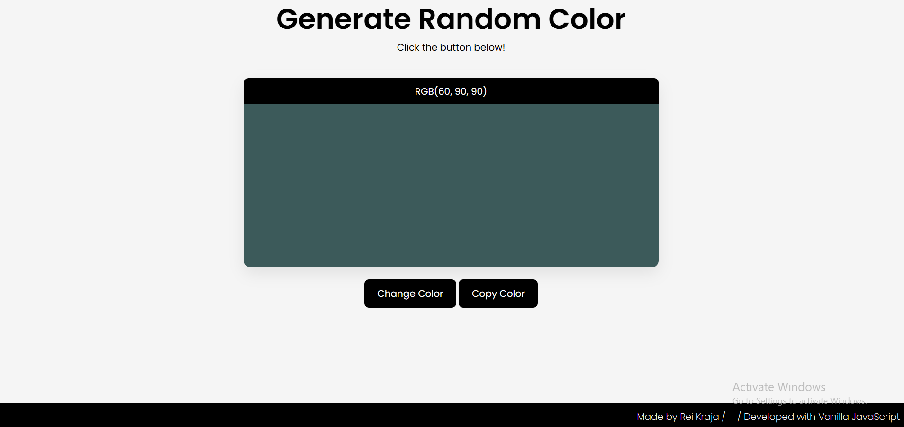

# 001 — Random Color Generator

> **Phase 1 — JS Fundamentals** | Experiment 1 of 100

---

## 🎯 What It Does

Generates a random RGB color when the user clicks Change Color, updates the background of the color box, and displays the generated RGB value.
A Copy Color button appears after generating a color and allows the user to copy the RGB code directly to the clipboard.

---

## 💡 What I Learned

- How to manipulate the DOM using document.querySelector and getElementById

- Creating elements dynamically with document.createElement

- Generating random numbers in JavaScript with Math.random() and Math.floor()

- Constructing RGB color strings dynamically

- Updating CSS styles from JavaScript

- Using the Clipboard API (navigator.clipboard.writeText)

- Handling asynchronous actions with async / await

- Providing user feedback using setTimeout

- Showing and hiding UI elements dynamically
---

## 🚧 Challenges I Faced

- Understanding how Math.random() works and how to convert it into RGB values between 0–255

- Selecting the correct button once multiple buttons were added to the page

- Figuring out how to reset the "Copied!" text back to "Copy Color" after a delay

- Learning when to use setTimeout instead of setInterval

- Making sure the Copy button only appears after a color is generated

---

## 🔗 Live Demo

[View Live](https://reiwebdeveloper.github.io/rei_creative_coding_lab/001_random_color_generator/)

---

## 📸 Preview

---

## ⏱️ Time Taken

~1 hour

---

[← Back to Main README](../README.md)