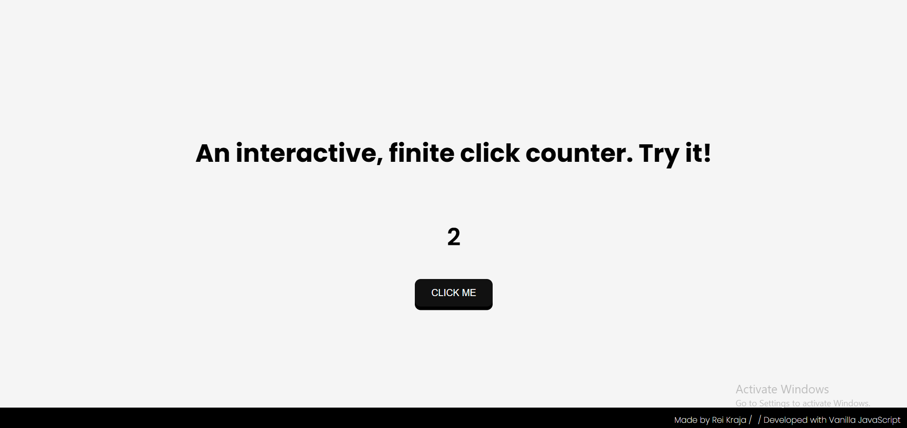
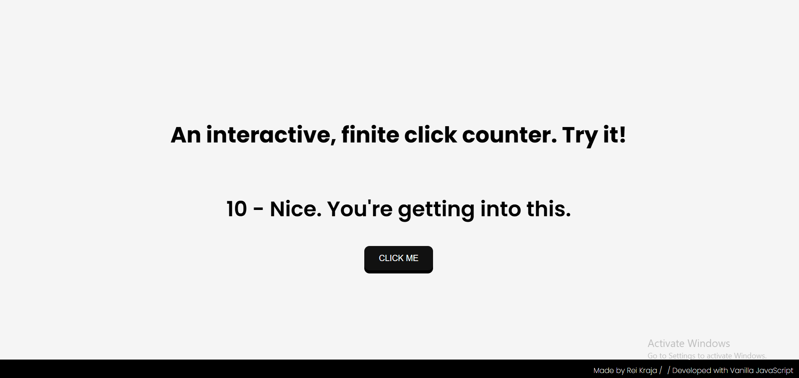

# 002 — Interactive Click Counter

> **Phase 1 — JS Fundamentals** | Experiment 2 of 100

---

## 🎯 What It Does

A playful interactive click counter built with **vanilla JavaScript**.  
The page reacts to user clicks with milestone messages, small pauses, and visual feedback.

The experience begins with a short **intro interaction**, then transitions into the main click counter where special milestone messages appear at specific counts.

If the user reaches **1000 clicks**, the game ends and displays a special **"MASTER CLICKER"** achievement screen.

---

## 💡 What I Learned

- Handling user interaction with `addEventListener`
- Updating page content dynamically using `textContent`
- Structuring interactive logic with **arrays** and **objects**
- Using objects as **lookup tables** for milestone messages
- Controlling UI elements using `style.display`
- Temporarily disabling buttons with the `disabled` property
- Creating timed interactions with `setTimeout`
- Triggering CSS animations using `classList.add()` and `classList.remove()`
- Building a simple **interactive UI flow** using conditional logic

---

## 🚧 Challenges I Faced

- Figuring out how to trigger milestone messages without writing many `if...else` statements
- Learning how to access object values dynamically using bracket notation (`object[key]`)
- Managing multiple UI states such as intro messages, counting mode, and the final screen
- Temporarily disabling the click button during milestone events
- Switching the layout when the game ends so only the achievement message and reset button are visible

---

## 🔗 Live Demo

[View Live](https://reiwebdeveloper.github.io/rei_creative_coding_lab/002_click_counter/)

---

## 📸 Preview
 

---

## ⏱️ Time Taken

~3 hours

---

[← Back to Main README](../README.md)