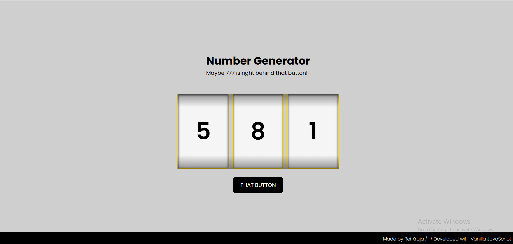

# 003 — Slot Machine Random Number Generator

> **Phase 1 — JS Fundamentals** | Experiment 3 of 100

---

## 🎯 What It Does

Generates three random numbers between 0–9 that spin like a slot machine when the user clicks the button.  
Numbers start spinning and stop one by one.  
The button is disabled during the spin to prevent multiple clicks and re-enabled once all slots have stopped.  
A gradient shadow effect gives the numbers a slot-machine window look, making it visually appealing.

---

## 💡 What I Learned

- How to manipulate the DOM using `document.getElementById` and `document.querySelectorAll`  
- Looping through multiple elements using `forEach`  
- Generating random numbers in JavaScript with `Math.random()` and `Math.floor()`  
- Animating elements using `setInterval` and `setTimeout`    
- Controlling UI state by enabling and disabling buttons  
- Basic CSS styling for creating a slot-machine visual, including shadows and gradient overlays  
- Structuring JavaScript code to be scalable and DRY (Don’t Repeat Yourself)

---

## 🚧 Challenges I Faced

- Understanding how to stop multiple intervals at different times to simulate a slot machine   
- Coordinating the timing so the last slot re-enables the button correctly  
- Making the slots look visually appealing with centered numbers and shadows  

---

## 🔗 Live Demo

[View Live](https://reiwebdeveloper.github.io/rei_creative_coding_lab/003_random_number_generator/)

---

## 📸 Preview

---

## ⏱️ Time Taken

~3–4 hours

---

[← Back to Main README](../README.md)