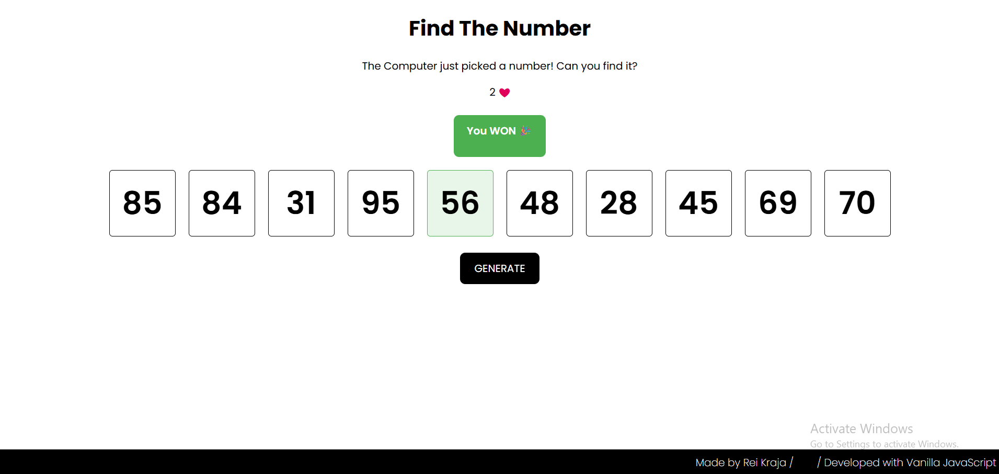

# 004 — Find The Number Game

> **Phase 1 — JS Fundamentals** | Experiment 4 of 100

---

## 🎯 What It Does

A simple interactive game where the user must find the correct number hidden inside one of multiple boxes.  
Each box contains a randomly generated number, but only one box is the correct choice.  

The user clicks on boxes to reveal numbers:
- If the correct box is selected → the user wins 🎉  
- If the wrong box is selected → the user loses a life  
- The user has a limited number of lives  
- When all lives are gone → the user loses 💀  

A dynamic message system displays win/lose feedback with color-coded UI (green for win, red for loss).  
The game can be restarted at any time using the **Generate** button.

---

## 💡 What I Learned

- Managing application state (`gameActive`, `userLives`, `correctIndex`)  
- Using `querySelectorAll` to work with multiple elements  
- Handling user interactions with `addEventListener`  
- Preventing repeated actions (e.g., clicking the same box multiple times)  
- Working with arrays to store dynamic data (`randomNumbersArr`)  
- Separating logic from UI updates for better structure  
- Dynamically updating the DOM (`textContent`, `style.display`)  
- Using `classList.add()` and `classList.remove()` for UI states  
- Creating simple animations using CSS transitions  
- Structuring a small game loop with win/lose conditions  

---

## 🚧 Challenges I Faced

- Understanding how to correctly assign and track the **correct box index**  
- Avoiding logic bugs like regenerating numbers on every click  
- Preventing users from clicking the same box multiple times  
- Debugging UI issues where elements updated in DevTools but were not visible  
- Fixing layout issues caused by Flexbox (boxes overflowing in one row)  
- Making the UI feedback (win/lose message) smooth and visible  

---

## 🔗 Live Demo

[View Live](https://reiwebdeveloper.github.io/rei_creative_coding_lab/004_find_the_number/)

---

## 📸 Preview

---

## ⏱️ Time Taken

~4–6 hours

---

[← Back to Main README](../README.md)
