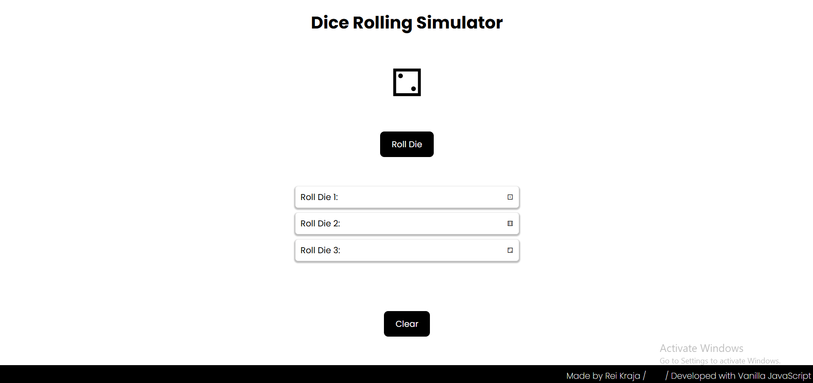

# 005 — Dice Rolling Simulator

> **Phase 1 — JS Fundamentals** | Experiment 5 of 100

---

## 🎯 What It Does

A simple interactive dice roller where the user clicks a button to roll a die. A CSS animation plays on each click, and after it finishes, a random die face (1–6) is revealed. Every roll result is stored in a scrollable history list so the user can keep track of previous rolls without the page growing endlessly.

---

## 💡 What I Learned

- Selecting DOM elements with `getElementById` and `querySelectorAll` (and the importance of the `.` prefix for class selectors)
- The difference between functions that **return a value** vs functions that **update the DOM**
- Dynamically creating and appending elements with `document.createElement()` and `appendChild()`
- Using `children.length` to auto-number list items before appending new ones
- Triggering and re-triggering CSS animations from JavaScript with `classList.add()` / `classList.remove()`
- Forcing a browser reflow with `void element.offsetWidth` to reset animations on repeated clicks
- Using `setTimeout()` to sync DOM updates with animation duration
- Disabling and re-enabling a button to prevent spam clicks during an animation
- Constraining a growing list with `height` + `overflow-y: auto`
- Fixing `box-shadow` clipping caused by `overflow` using padding on the parent container

---

## 🚧 Challenges I Faced

- Figuring out why the animation only triggered on the first click and not on subsequent ones
- Understanding why `void element.offsetWidth` is needed to force the browser to "see" the class removal before re-adding it
- Syncing the `setTimeout` delay with the CSS `animation-duration` so the die face updates exactly when the animation ends
- The `box-shadow` on history items getting clipped after adding `overflow-y: auto` to the list container

---

## 🔗 Live Demo

[View Live](https://reiwebdeveloper.github.io/rei_creative_coding_lab/005_dice_rolling_simulator/)

---

## 📸 Preview

---

## ⏱️ Time Taken

~2–3 hours

---

[← Back to Main README](../README.md)