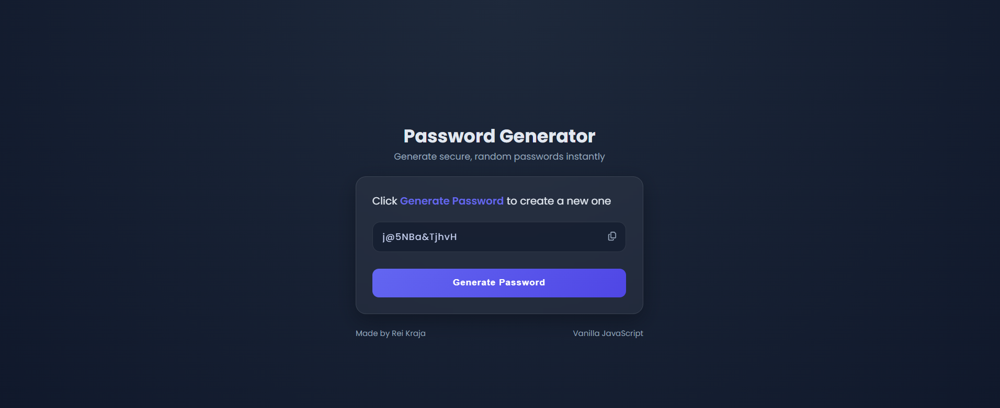

# 006 — Random Passowrd Generator

> **Phase 1 — JS Fundamentals** | Experiment 6 of 100

---

## 🎯 What It Does

A clean, modern password generator that creates secure random passwords using a mix of:

- Lowercase letters
- Uppercase letters
- Numbers
- Symbols

The user clicks Generate Password, and a new password instantly appears.
A copy button allows users to copy the password to clipboard, with a checkmark success animation for visual feedback.

---

## 💡 What I Learned

- Building a random password generator algorithm
- Creating and combining character pools (lowercase, uppercase, numbers, symbols)
- Building strings dynamically inside loops
- Understanding random index selection from a string
- Triggering and re-triggering CSS animations from JavaScript with `classList.add()` / `classList.remove()`
- Using navigator.clipboard.writeText() to copy text
- Working with async / await for clipboard operations
- Adding UI micro-interactions using classList.add() and setTimeout()
- Dynamically switching Font Awesome icons (fa-copy → fa-check)
- Using CSS transitions for smooth visual feedback

---

## 🚧 Challenges I Faced

- Understanding how to randomly select characters from multiple character sets
- Deciding whether to use one variable or multiple variables for character pools
- Learning how clipboard API works with async functions
- Implementing a non-disruptive success animation for copy action
- Making the icon temporarily change to a checkmark and revert back

---

## 🔗 Live Demo

[View Live](https://reiwebdeveloper.github.io/rei_creative_coding_lab/006_password_generator/)

---

## 📸 Preview

---

## ⏱️ Time Taken

~8-9 hours

---

[← Back to Main README](../README.md)