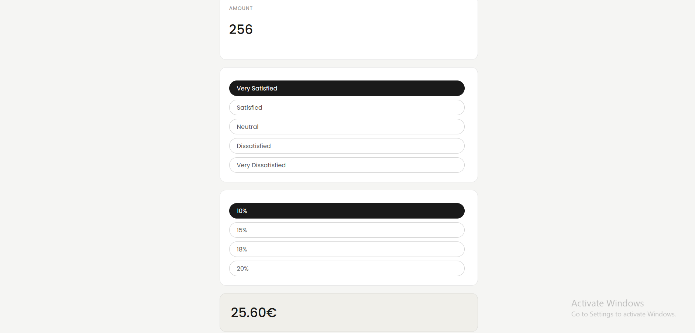

# 008 — Tip Calculator

> **Phase 1 — JS Fundamentals** | Experiment 8 of 100

---

## 🎯 What It Does

A simple, modern tip calculator:

- Dynamic Tip Calculation: Calculates precise tip amounts based on user-selected percentages.
- Custom Selection Pills: Replaces boring standard radio buttons with interactive, styled "pills" for service quality and tip amounts.
- Smart Validation: - Prevents calculations for amounts under 10€ or over 1,500€.
- Blocks negative numbers and empty inputs.
- Ensures a percentage is selected before running the math.
- Charity Greet Message: A smooth transition that displays a thank-you message once the calculation is complete.
- Currency Formatting: Automatically formats results to two decimal places with the Euro symbol.

---

## 💡 What I Learned

- Advanced Event Delegation: Learning how to capture clicks on a parent container (.userChoice) and manually trigger a hidden child input.

- DOM Traversal: Using .querySelector() and .closest() to navigate the HTML tree and find specific elements relative to the one clicked.

- Array-like Object Management: Using querySelectorAll().forEach() to loop through groups of elements to reset their visual state (removing the .active class).

- Optional Chaining: Using ?.value to safely check if a radio button is selected without crashing the script if nothing is picked.

- Guard Clauses: Using early return statements to handle errors (like invalid amounts) before the main logic runs, making the code cleaner and easier to read.

- CSS-to-JS Synergy: Using JavaScript to toggle classes that trigger CSS transitions (like the .show class for the thank-you message).

---

## 🚧 Challenges I Faced

- The "Pill" Logic: It was tricky to figure out how to make a div act like a radio button. I had to write logic that "unchecks" all other items in a group visually while simultaneously updating the actual hidden radio input so the form data stayed accurate.

- UI/UX Styling: Moving away from default browser elements required a lot of CSS fine-tuning. Getting the "pills" to look consistent and feel responsive when clicked took several iterations of layout tweaking.

- Input Constraints: Implementing the specific range limits (10€ to 1500€) required careful placement of if statements to ensure the user gets clear feedback via the cautionMessage before they get confused by a missing result.

---

## 🔗 Live Demo

[View Live](https://reiwebdeveloper.github.io/rei_creative_coding_lab/008_tip_calculator/)

---

## 📸 Preview

---

## ⏱️ Time Taken

~3-5 hours

---

[← Back to Main README](../README.md)