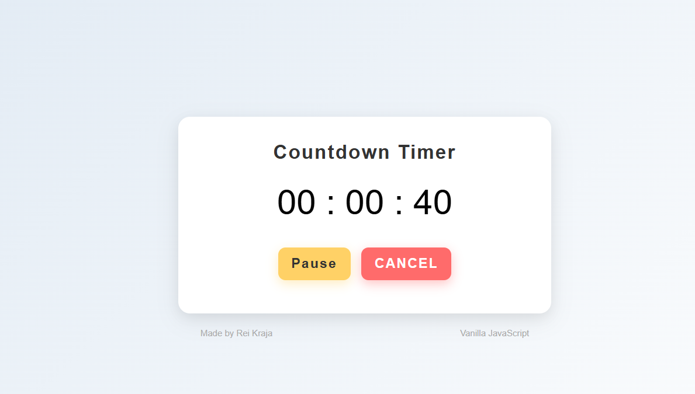

# 009 — Tip Calculator

> **Phase 1 — JS Fundamentals** | Experiment 9 of 100

---

## 🎯 What It Does

- Set custom hours, minutes and seconds
- Start, pause/resume and cancel the countdown
- Displays a clear "EXPIRED" message when the timer reaches zero
- Automatically resets the UI after expiry
- Lightweight — pure vanilla JS, no dependencies

---

## 💡 What I Learned

- **Interval Management:** Storing the `setInterval` reference in an outer-scoped variable so it can be cleared by pause and cancel handlers — not just the function that created it.
 
- **Pause/Resume Logic:** Capturing `remainingTime` at the moment of pause and recalculating a new `targetTime` on resume, rather than trying to freeze and unfreeze the interval directly.
 
- **Target-Time Pattern:** Using `targetTime = Date.now() + remainingMs` and recomputing remaining time on every tick, which keeps the timer accurate even if the tab is backgrounded or the interval drifts.
 
- **Guard Clauses:** Clearing any existing interval at the top of the start handler to prevent two intervals racing if the button is clicked more than once.
 
- **DOM State Management:** Keeping the UI in sync with timer state (running / paused / idle) by centralising show/hide logic and always resetting button labels alongside display visibility.

---

## 🚧 Challenges I Faced

- **Scoping the Interval Reference:** The biggest bug was declaring the interval with `const` inside the click handler, making it invisible to the pause and cancel buttons. Lifting it to the outer scope and switching to `let` was the key fix.
 
- **Wiring Up the Buttons:** The pause and cancel buttons were rendered in the UI but had no event listeners attached, so they did nothing. Adding the listeners and tying them to the shared state variables made everything work together.
 
- **The 1-Second Blank:** Because `setInterval` waits a full second before its first tick, the display was empty for a moment after hitting Start. Extracting the tick logic into a named function and calling it once immediately before starting the interval fixed the flicker.

---

## 🔗 Live Demo

[View Live](https://reiwebdeveloper.github.io/rei_creative_coding_lab/009_countdown/)

---

## 📸 Preview

---

## ⏱️ Time Taken

~4-6 hours

---

[← Back to Main README](../README.md)