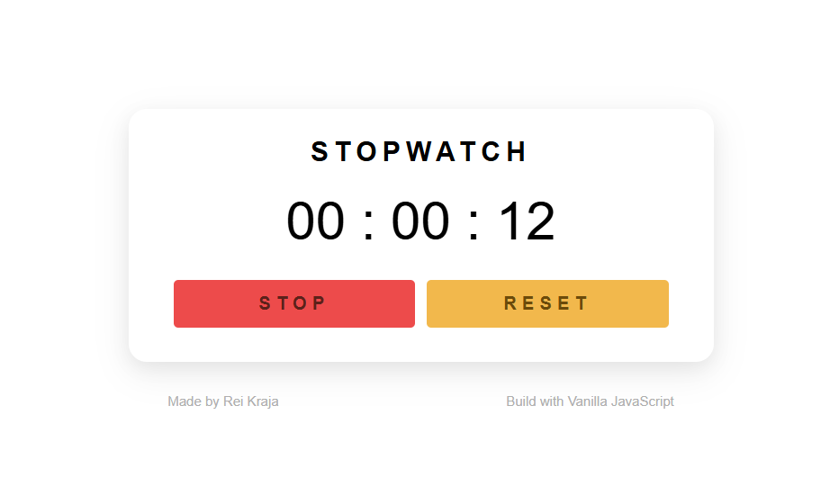

# 010 — Stopwatch

> **Phase 1 — JS Fundamentals** | Experiment 10 of 100

---

## 🎯 What It Does
 
- Start, stop/pause and reset the stopwatch
- Displays elapsed time in hours, minutes and seconds
- Accurate timing even when the tab is backgrounded or the interval drifts
- Button dynamically changes label and colour to reflect running / stopped state
- Lightweight — pure vanilla JS, no dependencies

---

## 💡 What I Learned

- **Elapsed-Time Pattern:** Using `(Date.now() - startTime) + savedElapsed` on every tick instead of incrementing a counter, which keeps the display accurate regardless of interval drift or tab throttling.
 
- **Pause/Resume Without Losing Time:** Saving elapsed milliseconds into `savedElapsed` at the moment of pause, then adding them back on the next start, so the stopwatch always picks up exactly where it left off.
 
- **10ms Interval for Smoothness:** Running `setInterval` at 10 ms rather than 1 000 ms so the display updates feel immediate — while still flooring to whole seconds for the rendered output.
 
- **Button-Label as State Flag:** Using `innerHTML === "START"` as a lightweight running/stopped flag to decide which branch of `handleStartStop` to execute, keeping state implicit in the UI itself.
 
- **Guard on Reset:** Always calling `clearInterval` and nulling the reference in the reset handler, ensuring no stale interval keeps ticking after the display returns to zero.

---

## 🚧 Challenges I Faced

- **Drift with a Simple Counter:** An early version incremented a `seconds` variable on each interval tick, but the count drifted noticeably over time. Switching to the `Date.now()` subtraction approach made it wall-clock accurate.
 
- **Resuming From the Right Point:** After pausing, the first attempt restarted `startTime` from `Date.now()` and discarded previous elapsed time, causing the display to jump back. Introducing `savedElapsed` to carry forward the paused amount fixed the reset-on-resume bug.
 
- **Interval Left Running After Reset:** During testing the reset button cleared the display but the internal interval kept firing, making the counter jump as soon as Start was pressed again. Adding `clearInterval(stopwatchInterval)` and resetting all state variables in `handleReset` resolved it cleanly.

---

## 🔗 Live Demo

[View Live](https://reiwebdeveloper.github.io/rei_creative_coding_lab/010_stopwatch/)

---

## 📸 Preview

---

## ⏱️ Time Taken

~3-4 hours

---

[← Back to Main README](../README.md)