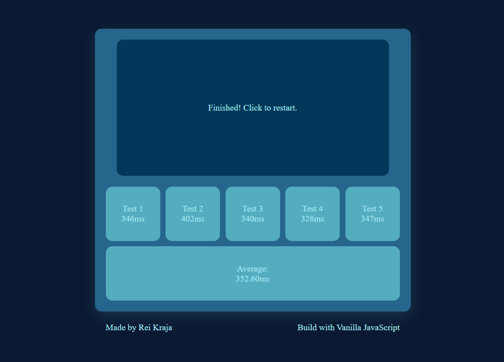

# 011 — Reaction Speed Test

> **Phase 1 — JS Fundamentals** | Experiment 11 of 100

---

## 🎯 What It Does

- Flashes a box red after a random delay and measures how fast you click it
- Runs 5 rounds and displays each result plus your average reaction time
- Ends the game immediately if you click too early — no second chances
- Ends the game if you take longer than 5 seconds to react
- Requires a manual "Click Again" confirmation between rounds to keep the pacing in your control
- Lightweight — pure vanilla JS, no dependencies

---

## 💡 What I Learned

- **Game State Machine:** Managing a `gameState` variable (`"idle"`, `"waiting"`, `"ready"`, `"confirming"`, `"finish"`) so a single `handleClick()` function routes each click to the right action depending on what phase the game is in.

- **Reaction Time with `Date.now()`:** Recording `startTime = Date.now()` the moment the box turns red, then computing `Date.now() - startTime` on click gives an accurate millisecond reaction time without any counter drift.

- **Chained `setTimeout` Instead of `setInterval`:** Using nested `setTimeout` calls to sequence game phases (instruction → random wait → red flash) rather than an interval, making it easy to cancel any individual phase without affecting the others.

- **Random Delay for Fairness:** Using `Math.floor(Math.random() * 5000) + 1000` to generate a 1–6 second random wait before the red flash, so the player cannot just time their click in advance.

- **Centralised `endGame()` Function:** Routing all ways the game can end (too early, too slow, all rounds done) through one single function, keeping the code clean and avoiding repeated logic.

---

## 🚧 Challenges I Faced

- **Background Turning Gray Too Early:** The first version changed the background to gray as soon as the waiting phase started, giving the player a visual cue that a click was coming. Keeping it blue until red appears removes that unintentional hint.

- **Auto-Advancing Between Rounds:** An earlier version used `setTimeout` to automatically start the next round after 2 seconds. This felt rushed and the player had no control. Replacing it with a manual "Click Again" step fixed the pacing.

- **Too Many Timeout Variables:** The original code tracked four separate timeout references (`instructionTimeout`, `reactionTimeout`, `betweenRoundTimeout`, `maxReactionTimeout`), making it hard to keep track of what to cancel when. Simplifying to two (`reactionTimeout`, `maxReactionTimeout`) made the logic much easier to follow.

- **Dead Code in `tooEarly()`:** There was an `else { restart() }` branch inside the too-early handler that could never actually be reached, because `handleClick()` already routed those states elsewhere before calling it. Removing the function entirely and replacing it with a direct `endGame()` call cleaned this up.

---

## 🔗 Live Demo

[View Live](https://reiwebdeveloper.github.io/rei_creative_coding_lab/011_speed_test/)

---

## 📸 Preview

---

## ⏱️ Time Taken

~5-6 hours

---

[← Back to Main README](../README.md)