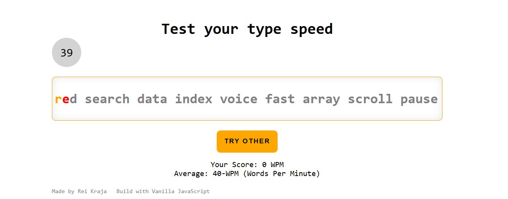

# 012 — Type Speed Test

> **Phase 1 — JS Fundamentals** | Experiment 12 of 100

---

## 🎯 What It Does

- Displays a random sequence of words and measures how fast and accurately you type them
- Starts the 60-second countdown only when the user begins typing — no pressure before you're ready
- Slides the text to the left as you type, keeping the current character always in focus
- Colors each character green on correct input and red on wrong input — you cannot advance until the right key is pressed
- Calculates and displays your WPM (Words Per Minute) score when time runs out
- Resets everything cleanly with a "Try Other" button — new random words, fresh timer, zero score
- Lightweight — pure vanilla JS, no dependencies

---

## 💡 What I Learned

- **Flat Index Over Nested Loops:** Instead of looping over words and then characters, tracking a single `currentIndex` across the full joined string makes it easy to know exactly where the user is at any point, and maps directly to span elements and `translateX` offset.

- **Pre-rendering Spans for Character Styling:** Splitting the full text into individual `` elements on load allows toggling `.correct` and `.wrong` CSS classes per character without touching the rest of the DOM.

- **`translateX` for Smooth Scrolling:** Using `textToWrite.style.transform = translateX(-${currentIndex * avgCharWidth}px)` combined with a CSS `transition` creates a smooth typewriter-track effect as the user types, keeping the active character centered in view.

- **Dynamic Average Character Width:** Computing `avgCharWidth = textToWrite.offsetWidth / fullText.length` at runtime instead of hardcoding a pixel value makes the sliding accurate regardless of font, font size, or text length.

- **Lazy Timer Start:** Using a `timerStarted` boolean flag and calling `countdown()` only on the first keydown means the 60 seconds begin exactly when the user starts typing, not when the page loads.

- **Game State with Boolean Flags:** Managing `timerStarted` and `gameOver` as simple booleans keeps the keydown listener clean — two early returns at the top handle all invalid states before any logic runs.

---

## 🚧 Challenges I Faced

- **Text Overflowing the Viewport:** Setting `white-space: nowrap` on the text element without `overflow: hidden` on the container caused the text to stretch beyond the device width. Fixing the container with a `max-width` and `overflow: hidden` constrained it correctly.

- **`spans` Queried Before DOM Was Ready:** The initial `querySelectorAll("span")` call ran before `selectRandomWords()` had built the spans, returning an empty list. Moving the query to the end of `selectRandomWords()` and making `spans` a module-level `let` fixed the timing.

- **`selectRandomWords()` Called Inside Keydown:** An early version accidentally called `selectRandomWords()` on every keypress, rebuilding the DOM and resetting the text on each character typed. Moving it outside the listener to only run on load and reset fixed this.

- **Score Always Showing 0 WPM:** `calculateScore()` was called after `currentIndex` was already reset to `0` inside `typeSpeedTestFinished()`. Swapping the order — calculate first, then reset — fixed the score display.

- **`wordsPool` Emptying on Reset:** The original approach spliced words directly from `wordsPool`, so after the first game it was empty. Switching to a `poolCopy = [...wordsPool]` spread inside `selectRandomWords()` keeps the original pool intact across resets.

---

## 🔗 Live Demo

[View Live](https://reiwebdeveloper.github.io/rei_creative_coding_lab/012_type_speed_test/)

---

## 📸 Preview

---

## ⏱️ Time Taken

~6-7 hours

---

[← Back to Main README](../README.md)