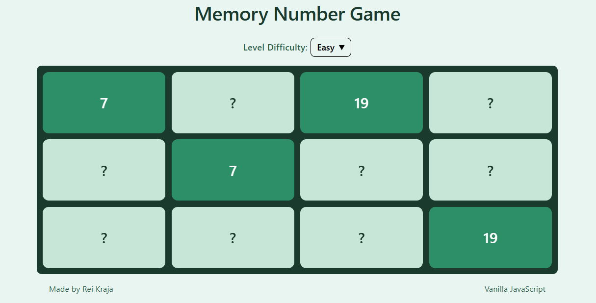

# 013 — Memory Card Matching Game

> **Phase 1 — JS Fundamentals** | Experiment 13 of 100

---

## 🎯 What It Does

- Generates a grid of face-down cards based on selected difficulty (Easy, Medium, Hard)
- Each card hides a number — every number appears exactly twice (pairs)
- Shuffles all pairs randomly on every new game
- Lets the user flip two cards at a time to find matching pairs
- Keeps matched cards flipped and disables further interaction with them
- Flips non-matching cards back after a short delay
- Prevents spam clicking during comparison using a board lock mechanism
- Automatically restarts the game with a fresh shuffled set once all pairs are matched
- Lightweight — pure vanilla JavaScript, no dependencies

---

## 💡 What I Learned

- **State Management with DOM References:** Instead of storing just values, keeping references to the actual clicked DOM elements (`firstCard`, `secondCard`) makes it easier to manipulate UI and compare data via `dataset`.

- **Fisher–Yates Shuffle Algorithm:** Properly shuffling an array using index swapping ensures unbiased random distribution, unlike naive random placement.

- **Using `dataset` for Data Binding:** Assigning `data-index` and `data-value` directly to DOM elements creates a clean bridge between UI and logic without needing complex data structures.

- **Finite State Machine Thinking:** The game operates in clear states — first click, second click, comparison, reset — which simplifies reasoning and prevents bugs.

- **Locking UI During Async Operations:** Using a `lockBoard` flag prevents user interaction while `setTimeout` is running, avoiding race conditions and broken state.

- **Separation of Concerns:** Splitting logic into functions like `randomNumbers`, `renderCard`, and `startNewGame` keeps responsibilities isolated and code maintainable.

---

## 🚧 Challenges I Faced

- **Generating True Pairs (Not Random Duplicates):** Initially, random numbers could repeat more than twice, creating invalid game states. Fixing this required generating unique numbers first, then duplicating them to form exact pairs.

- **Rendering Before Data Was Ready:** Early versions rendered cards before generating numbers, causing empty or incorrect UI. Reordering logic (generate → render) resolved this.

- **Tracking Card Identity:** Without using `data-*` attributes, it was difficult to know which card was clicked or compare values. Adding `dataset` properties solved this cleanly.

- **Handling Rapid User Clicks:** Clicking multiple cards quickly broke the game logic. Introducing a `lockBoard` flag ensured controlled interaction.

- **Clicking the Same Card Twice:** The game initially allowed matching a card with itself. Adding a check (`if (firstCard === clickedCard) return;`) fixed this edge case.

- **Reset Timing Issues:** Restarting the game immediately after the last match felt abrupt. Adding a delay improved UX and gave visual closure.

---

## 🔗 Live Demo

[View Live](https://reiwebdeveloper.github.io/rei_creative_coding_lab/013_memory_number_game/)

---

## 📸 Preview

---

## ⏱️ Time Taken

~8-9 hours

---

[← Back to Main README](../README.md)