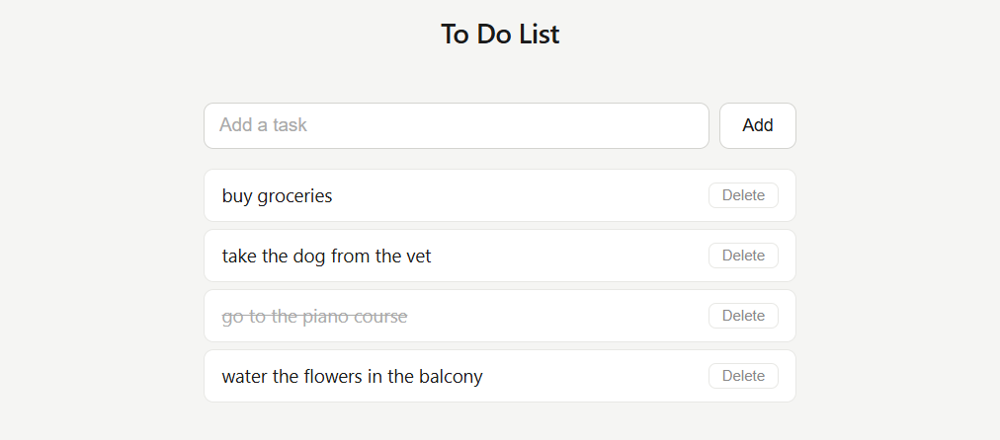

# 014 — To-Do List App

> **Phase 1 — JS Fundamentals** | Experiment 14 of 100

---

## 🎯 What It Does

- Allows users to add tasks dynamically via an input form
- Prevents empty submissions with a validation message
- Limits the number of tasks to a maximum of 10
- Displays each task with a delete button
- Lets users mark tasks as completed (toggle checked state)
- Updates UI based on task completion status
- Removes tasks from both the DOM and internal data structure
- Uses event delegation for efficient event handling
- Lightweight — pure vanilla JavaScript, no dependencies

---

## 💡 What I Learned

- **Event Delegation & Target Resolution:** Instead of attaching listeners to each task, handling clicks at the parent `<ul>` level and using `.closest("li")` ensures scalability and cleaner logic.

- **Separation of Data and UI:** Maintaining a `listArr` as the source of truth and syncing the DOM based on state changes prevents inconsistencies.

- **Using `dataset` for Identification:** Assigning a unique `data-id` to each `<li>` creates a reliable mapping between DOM elements and data objects.

- **State Toggling Logic:** Understanding how to properly toggle boolean values (`true ↔ false`) instead of forcing state changes.

- **Guard Clauses for Stability:** Early returns like `if (!e.target.closest("li")) return;` prevent runtime errors and improve robustness.

- **Branching Interaction Logic:** Differentiating between multiple user actions (delete vs toggle) within a single event listener.

- **Array Manipulation Techniques:** Using `findIndex` to locate and update/remove specific items efficiently.

---

## 🚧 Challenges I Faced

- **Click Target Confusion:** Initially assumed clicks would always target `<li>` elements, but clicks often landed on child elements like ``. Solved using `.closest("li")`.

- **Null Reference Errors:** Attempted to access `dataset` on elements that didn’t exist due to invalid click targets. Fixed by validating context before accessing properties.

- **Mixing UI and Data Logic:** Early versions toggled classes without updating the underlying data, causing inconsistencies. Refactored to make data the source of truth.

- **Incorrect Toggle Implementation:** Initially used conditional logic that didn’t actually change state. Learned to properly invert boolean values.

- **Scope Issues:** Tried to use variables (`li`, `id`) before defining them in certain branches, leading to errors.

- **Combining Multiple Actions Incorrectly:** Delete and toggle logic were overlapping, causing unintended behavior. Fixed by clearly separating interaction paths.

---

## 🔗 Live Demo

[View Live](https://reiwebdeveloper.github.io/rei_creative_coding_lab/014_to_do_list/)

---

## 📸 Preview

---

## ⏱️ Time Taken

~6–7 hours

---

[← Back to Main README](../README.md)