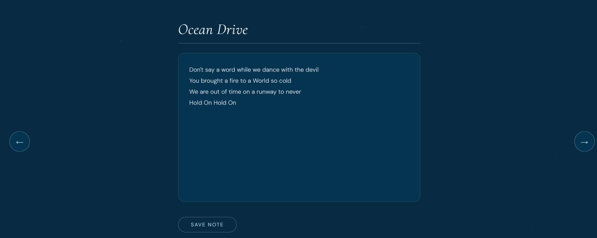

# 015 — Note App

> **Phase 1 — JS Fundamentals** | Experiment 15 of 100

---

## 🎯 What It Does

- Allows users to write and save notes with a title and content
- Validates input before saving — prevents empty titles or content
- Displays saved notes as a responsive grid of cards
- Truncates long note previews cleanly in the card grid
- Opens any note in a full expanded view on click
- Lets users delete individual notes with a dedicated button
- Persists all notes across page refreshes using `localStorage`
- Navigates between three pages (write, list, expanded) without any routing library
- Lightweight — pure vanilla JavaScript, no dependencies

---

## 💡 What I Learned

- **Object References vs Copies:** Discovered that pushing an object directly into an array pushes a reference, not a snapshot. All array entries pointed to the same object. Solved by creating a new object literal on each save instead of reusing a shared one.

- **Closures in Event Listeners:** Each note card's delete and click listeners close over the `obj`, `liEl`, and `noteArr` variables from `showNote`. This made id-based filtering and DOM removal possible without any extra lookup.

- **Event Bubbling & `stopPropagation`:** Clicking the delete button also triggered the parent `<li>` click listener, opening the note while deleting it. Fixed by calling `event.stopPropagation()` inside the delete listener.

- **CSS Truncation with `-webkit-line-clamp`:** Instead of slicing strings in JS, used CSS to visually clip card content to 4 lines while keeping the full data intact in the DOM and in the object — important for the expanded view.

- **`filter` for Immutable Array Updates:** Used `noteArr = noteArr.filter(note => note.id !== obj.id)` to remove a note. Learned that `filter` returns a new array and keeps only items where the condition is `true`, so the logic is "keep everything that is NOT this note."

- **localStorage Sync Strategy:** Identified the two exact moments `noteArr` changes (save and delete) and called `localStorage.setItem` at both. On load, parsed the stored array and re-rendered each note through the existing `showNote` function.

- **Single-Responsibility Functions:** `showNote` handles one note at a time rather than re-rendering the whole list. This made the load, save, and render flows all reuse the same function cleanly.

---

## 🚧 Challenges I Faced

- **All Cards Showing the Same Note:** Pushed the same `note` object reference into the array on every save. Every entry pointed to the same object so they all reflected the latest update. Fixed by constructing a fresh object literal each time.

- **Delete Triggering the Open View:** The delete button sits inside the `<li>` so its click event bubbled up and also fired the open-note listener. Solved with `event.stopPropagation()` on the delete listener.

- **`const` Blocking Array Reassignment:** Tried to reassign `noteArr` after filtering but it was declared with `const`. Switched to `let` since the variable itself needed to point to a new array after each delete.

- **`filter` Logic Confusion:** Initially wrote `note.id === noteId` thinking filter would remove matches. Learned that filter *keeps* what returns `true`, so the condition needed to be `!==` to keep everything except the deleted note.

- **localStorage Only Restoring Data, Not the UI:** Parsing the saved array on load correctly restored `noteArr` but the page was still empty. Realised that DOM elements don't persist — had to loop through the loaded array and call `showNote` for each note to rebuild the UI.

---

## 🔗 Live Demo

[View Live](https://reiwebdeveloper.github.io/rei_creative_coding_lab/015_note_app/)

---

## 📸 Preview

---

## ⏱️ Time Taken

~8 hours

---

[← Back to Main README](../README.md)