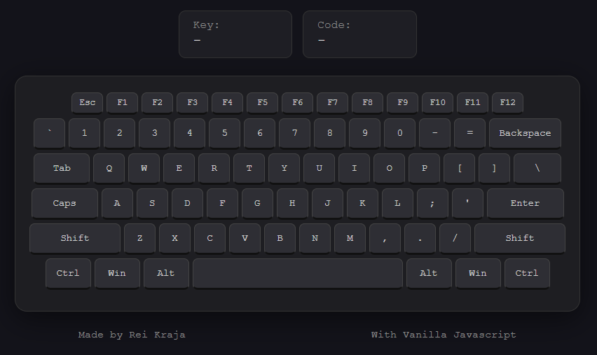

# 016 — Keyboard Key Visualizer

> **Phase 1 — JS Fundamentals** | Experiment 16 of 100

---

## 🎯 What It Does

- Visualizes an entire standard ANSI keyboard layout on-screen in real-time
- Captures global keyboard inputs from anywhere on the window without input fields
- Displays live diagnostic data including the exact `event.key` character value and `event.code` location value
- Dynamically highlights active keys by adding and removing visual states on keydown and keyup
- Prevents continuous performance overhead and UI flickering when keys are held down long-term
- Formats empty space character feeds cleanly into a readable "Space" text label in the status bar
- Leverages proportional responsive sizing for utility keys (Space, Shift, Backspace, Enter) to mimic a physical desk deck
- Lightweight — pure vanilla JavaScript, semantic HTML5 data attributes, and zero dependencies

---

## 💡 What I Learned

- **`event.code` vs `event.key`:** Discovered that `event.key` changes based on modifiers (like lowercase 'a' turning to uppercase 'A' with Shift), whereas `event.code` reflects the immutable physical location of the key on the board (e.g., `KeyA`).

- **Global Event Distribution:** Learned that you don't need to bind individual event listeners to dozens of HTML buttons. Listening globally on the `window` object intercepts all operating system keyboard signals seamlessly.

- **Dynamic Attribute Sub-Selection:** Used template literals to construct a dynamic DOM query `document.querySelector([data-key="${event.code}"])`. This allowed linking the physical hardware string directly to its corresponding HTML node instantly.

- **The `event.repeat` Performance Guard:** Identified that holding down a physical key fires the `keydown` event sequentially dozens of times a second. Implemented an early return statement with `event.repeat` to prevent heavy, unnecessary DOM updates.

- **Text Replacement Overwrite Control:** Corrected a classic text-stacking mistake by switching from string appending (`+=`) to direct element updating (`=`), ensuring the diagnostic panel only tracks the immediate, current key press.

- **CSS Flexbox Scale Proportions:** Used custom CSS width styling rules across specific class selectors (like `.space-key` or `.enter-key`) to create a realistic physical keyboard form factor using proportional flex dimensions.

---

## 🚧 Challenges I Faced

- **HTML ID Invalidation from Reused Identifiers:** Accidentally cloned identical `id="keyboard-key-holder"` strings across all the digital key nodes, breaking strict HTML validity specs. Resolved by migrating them over into a standard `.keyboard-key-holder` class rule instead.

- **The Stacking Characters Bug:** Initial code strings kept appending every typed key into a giant snowball string block inside the telemetry box. Solved by replacing string accumulation logic with single value overriding.

- **UI Chaos from Held Down Long-Presses:** Holding down keys flooded the system loop with redundant query selectors and class injections, causing layout micro-stutters. Fixed cleanly by validating the boolean state of `event.repeat` at the front of the call stack.

- **Invisible Characters Rendering Nothing:** Pressing the spacebar generated an actual empty string `" "`, making the live indicator widget look completely broken and empty. Handled explicitly with a conditional ternary statement to output a human-readable `"Space"` label.

- **Mismatched Variable String Layouts:** Certain keys didn't light up because physical OS key codes didn't align cleanly with standard character outputs. Solved comprehensively by binding structural targets against immutable `data-key` values like `ShiftLeft`, `Backquote`, and `Space`.

---

## 🔗 Live Demo

[View Live](https://reiwebdeveloper.github.io/rei_creative_coding_lab/016_keyboard_key_visualizer/)

---

## 📸 Preview

;

---

## ⏱️ Time Taken

~6 hours

---

[← Back to Main README](../README.md)