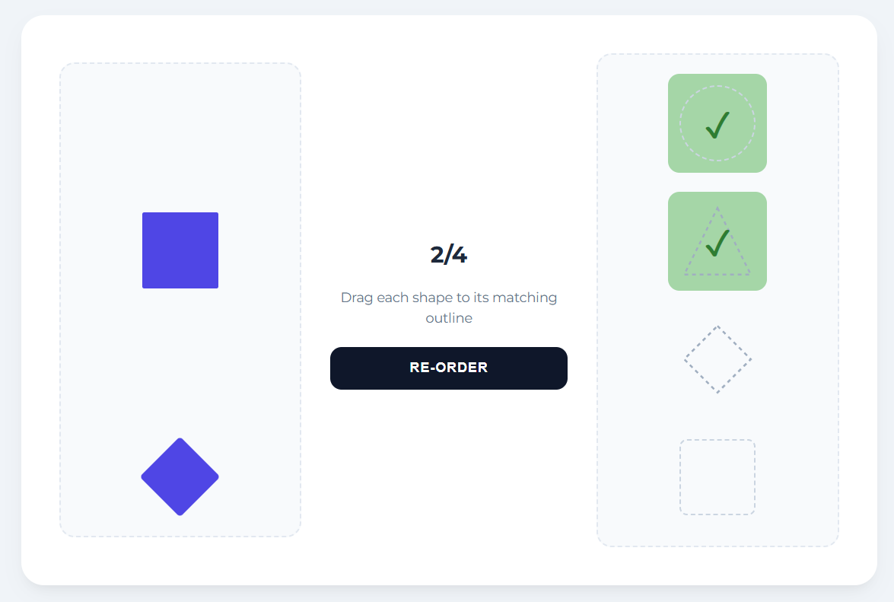

# 017 — Drag and Drop mini-game

> **Phase 1 — JS Fundamentals** | Experiment 17 of 100

---

## 🎯 What It Does

- Renders four filled shapes on the left and four matching dashed outlines on the right
- Lets the user drag each filled shape and drop it onto its correct outlined counterpart
- Highlights drop zones green when the correct shape hovers over them, and red for a mismatch — before the drop happens
- Locks matched zones so they cannot be overwritten by further drag events
- Displays a checkmark in the center of each successfully matched zone
- Tracks live match progress with a score counter
- Shuffles the right-side outlines into a random order when RE-ORDER is clicked, resetting the board
- Uses a custom SVG drag ghost image so shapes like the triangle and diamond look correct while dragging instead of showing a plain rectangle

---

## 💡 What I Learned

- **HTML Drag & Drop API:** Learned the full event lifecycle — `dragstart`, `dragover`, `dragleave`, and `drop` — and that calling `e.preventDefault()` inside `dragover` is required to allow dropping, otherwise the browser ignores the drop entirely.

- **`draggable` placement matters:** Discovered that putting `draggable="true"` on a wrapper div drags the entire container including its background. Moving it directly onto the shape element fixes the problem.

- **`setDragImage()` and the bounding box problem:** The browser always screenshots the full rectangular bounding box of an element as the drag ghost, so `clip-path` and `transform: rotate()` shapes always appeared as plain squares. Solved by building a fresh SVG element with `createElementNS` and passing it to `e.dataTransfer.setDragImage()` as the ghost.

- **`clip-path` and borders don't mix:** Using `clip-path` clips the entire box including its border, so dashed outlines are invisible. Learned to use SVG `<polygon>` with `stroke-dasharray` for dashed irregular shapes instead.

- **CSS triangle limitation:** The classic CSS border trick for triangles only produces solid colors — dashed outlines are impossible with it. SVG is the right tool for any outlined irregular shape.

- **ID parsing for dynamic matching:** Instead of writing a separate `if` for every shape, used `.replace()` to strip the prefix and suffix from element IDs (`filled-circle-shape` → `circle`) and compared the extracted shape names, making the logic work for all shapes at once.

- **`dataset` for DOM state:** Used `zone.dataset.matched = 'true'` to store match state directly on the DOM element, then checked it at the top of `dragover`, `dragleave`, and `drop` to protect matched zones from being overwritten.

- **`closest()` for DOM traversal:** Used `draggedShape.closest('.left-side-shape-container')` to walk up from the shape to its wrapper and hide the whole slot, preventing an empty gap from remaining after a match.

- **`position: relative` + `position: absolute`:** Learned that absolute positioning is always relative to the nearest ancestor with a position set. Had to add `position: relative` to the drop zone containers for the checkmark to center correctly inside them.

---

## 🚧 Challenges I Faced

- **Drag ghost showed a rectangle for triangle and diamond:** `clip-path` only clips visually — the actual DOM box is still a square, so the browser grabbed a rectangle as the ghost image. Fixed by generating a clean SVG element on `dragstart` and using it as the drag image instead.

- **Outlined triangle was fully black:** The CSS border trick for triangles uses solid border colors to fake the shape geometry, so `border-style: dashed` had no visible effect. Replaced the CSS triangle entirely with an inline SVG `<polygon>` using `stroke-dasharray`.

- **Outlined diamond showed nothing:** `clip-path` clips the border along with everything else, making dashed outlines invisible. Switched to SVG for the diamond outline as well.

- **Matched zones losing their background:** After a match was made, dragging another shape over the matched zone triggered `dragover` and overwrote the green background. Fixed by flagging matched zones with `dataset.matched` and returning early from all drag events on those zones.

- **Drop zone always highlighted green regardless of shape:** The `dragover` highlight was hardcoded to green without checking whether the dragged shape actually matched the zone. Moved the type comparison into `dragover` so the color reflects correct (green) or wrong (red) before the drop.

- **Empty slot remaining after a match:** Hiding just the shape left an invisible but space-occupying wrapper in the layout. Fixed by targeting the parent container with `closest()` and hiding that instead.

---

## 🔗 Live Demo

[View Live](https://reiwebdeveloper.github.io/rei_creative_coding_lab/017_drag_and_drop/)

---

## 📸 Preview

---

## ⏱️ Time Taken

~8-9 hours

---

[← Back to Main README](../README.md)