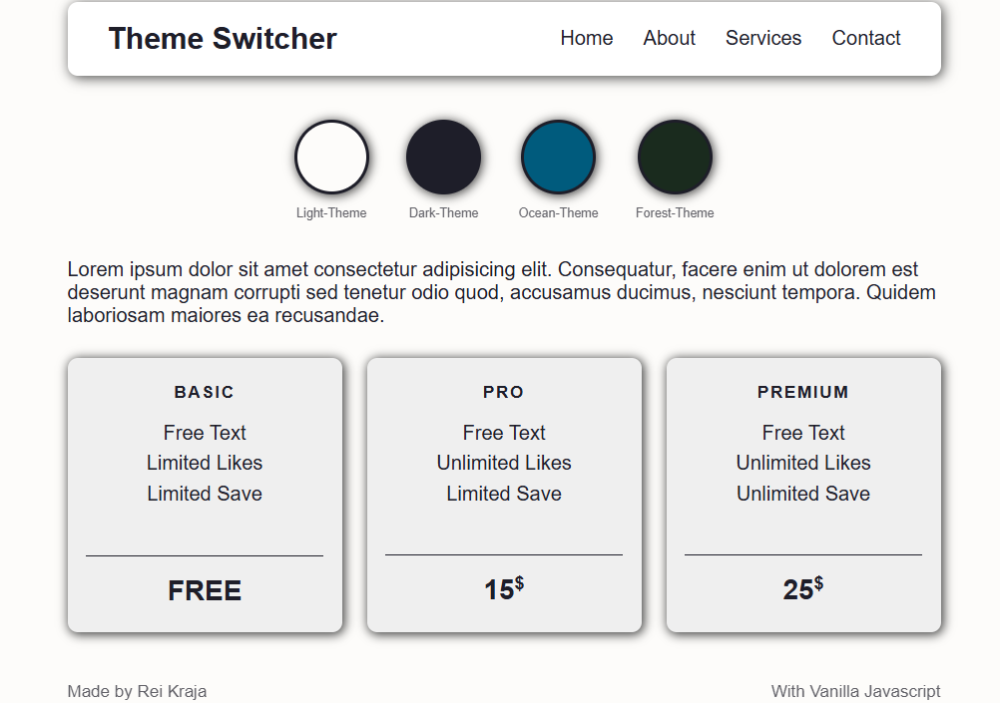

# 019 — Theme Switcher

> **Phase 1 — JS Fundamentals** | Experiment 19 of 100

---

## 🎯 What It Does

- Renders a page with a navbar, pricing cards, and a footer
- Provides four circular theme buttons — Light, Dark, Ocean, and Forest
- Switches the active theme by toggling a single class on the `<body>` element
- Persists the selected theme across page refreshes using `localStorage`
- Loads the last saved theme automatically on page load with a `'light-theme'` fallback for first-time visitors

---

## 💡 What I Learned

- **CSS custom properties as a theming system:** Instead of writing per-theme overrides for every component, defined a set of active variables (`--bg-color`, `--txt-color`, etc.) and remapped them inside each `body.theme-name` block. Every component reads the same variable names — swapping the class on `body` remaps the whole page automatically.

- **Consistent variable naming matters:** Mixed kebab-case (`--bg-color-light`) and camelCase (`--bgColor-dark`) in the same `:root` block caused confusion. Standardised everything to kebab-case and the codebase became much easier to reason about.

- **`localStorage` as source of truth for dynamic state:** Instead of tracking the current theme in a JS variable that goes stale, read it fresh from `localStorage` on every click with `localStorage.getItem('theme')`. Sidesteps the stale `const` problem entirely.

- **The stale variable trap:** Declared `currentTheme` as a `const` at page load and tried to use it inside `changeTheme()` to remove the old class. Since `const` never updates, the remove always targeted the original value — not the current one. Fixed by reading from `localStorage` directly inside the function instead.

- **`classList.remove(null)` is silent but wrong:** On a first visit with no `localStorage` entry, `getItem()` returns `null`. Calling `classList.remove(null)` doesn't crash but also doesn't remove the default theme class, leaving two theme classes on the body simultaneously. Fixed with the `||` fallback: `classList.remove(localStorage.getItem('theme') || 'light-theme')`.

- **Never put all theme classes on `<body>` in HTML:** An earlier attempt added all four theme classes directly in the markup. All themes were active at once, overriding each other based on CSS cascade order rather than JS logic. The body should start with one class only — or let JS handle it entirely.

- **Naming consistency between HTML, CSS, and JS:** Button classes, CSS theme blocks, and `localStorage` values all need to use the exact same strings. A mismatch between `'light'` and `'light-theme'` anywhere in the chain silently breaks the whole system.

---

## 🚧 Challenges I Faced

- **Nav links losing styles in dark mode:** Some selectors used `body.light-theme .nav-links a` (scoped to theme), others used `.nav-links a` with hardcoded light variables, and others used `body.dark-theme` overrides. Three different patterns fighting each other. Fixed by moving to a single active-variable pattern so every component is written once and works across all themes.

- **Dark mode missing border and shadow variables:** Light, Ocean, and Forest all defined `--border-color` and `--glow-shadow` but dark mode skipped them. Dark mode fell back to browser defaults for those properties and looked broken. Added the missing variables.

- **Theme stacking on repeat clicks:** The remove step targeted a hardcoded `'light-theme'` string rather than whatever was currently active. Clicking Ocean then Forest left both classes on the body. Fixed by reading the live value from `localStorage` on every click.

- **First visit edge case:** No `localStorage` entry meant `getItem()` returned `null`, which broke the remove step silently. Applied the `||` fallback consistently in both the initial load and inside `changeTheme()`.

---

## 🔗 Live Demo

[View Live](https://reiwebdeveloper.github.io/rei_creative_coding_lab/019_theme_switcher/)

---

## 📸 Preview

---

## ⏱️ Time Taken

~4-5 hours

---

[← Back to Main README](../README.md)