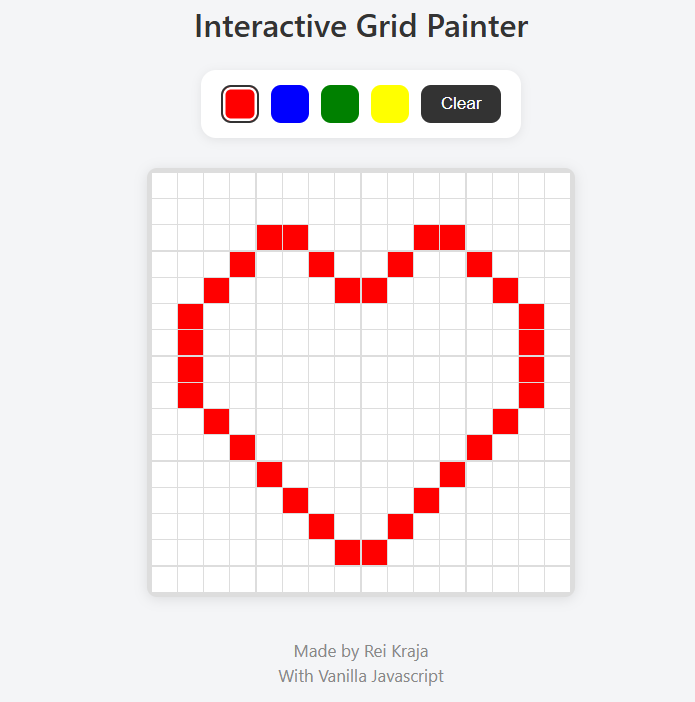

# 020 — Interactive Grid Painter

> **Phase 1 — JS Fundamentals** | Experiment 20 of 100

---

## 🎯 What It Does

- Renders a 16x16 pixel-art style grid on a canvas built from `div` cells
- Provides a color palette (red, blue, green, white) to select a paint color
- Paints cells on click, and continuously while dragging the mouse across the grid
- Supports right-click to erase a single cell back to white
- Includes a Clear button to reset the entire grid in one action
- Highlights the currently active color in the palette for clear visual feedback

---

## 💡 What I Learned

- **Event listener placement matters:** Originally added the `mousedown`/`mouseup` listeners on `document` *inside* the cell-creation loop, meaning every single cell attached its own copy of the same global listener. Moved them outside the loop so they're only registered once, regardless of grid size.

- **Tracking drag state with a simple boolean:** A single `isDrawing` flag toggled by `mousedown`/`mouseup` on `document` is enough to turn a bunch of independent `mouseenter` events into a "click-and-drag" painting experience. No complex state management needed.

- **`contextmenu` as a free eraser tool:** Instead of building a separate eraser mode, listening for `contextmenu` on each cell and calling `preventDefault()` (to stop the browser's right-click menu) gives a quick erase-on-right-click interaction almost for free.

- **`dragstart` fights with custom drag logic:** Browsers try to let you "drag" DOM elements by default, which interfered with the paint-by-drag behavior (cursor would show a ghost image instead of painting). Calling `e.preventDefault()` on `dragstart` at the document level stopped the browser from hijacking the interaction.

- **CSS variables aren't just for themes:** Reused ideas from the Theme Switcher experiment — consistent naming and small transitions (`transition: background-color 0.05s ease`) make the grid feel more responsive without any JS changes.

---

## 🚧 Challenges I Faced

- **Duplicate event listeners:** Didn't immediately notice the `document.addEventListener` calls were nested inside the grid-building loop. With a 16x16 grid that's 256 duplicate `mousedown`/`mouseup` listeners doing the same job — functionally harmless at this scale, but a bad habit that would scale poorly on a bigger grid. Fixed by moving them outside the function entirely.

- **Selected color had no visual feedback:** Clicking a palette button changed the paint color internally, but nothing on screen showed which color was currently active. Solved by toggling an `.active` class on the clicked button and giving it a distinct border/shadow style.

- **Browser drag behavior interfering with painting:** Dragging across cells sometimes triggered the browser's native element-drag behavior instead of the custom paint-on-drag logic. Fixed with a global `dragstart` prevention.

---

## 🔗 Live Demo

[View Live](https://reiwebdeveloper.github.io/rei_creative_coding_lab/020_interactive_grid_painter)

---

## 📸 Preview

---

## ⏱️ Time Taken

~2-3 hours

---

[← Back to Main README](../README.md)