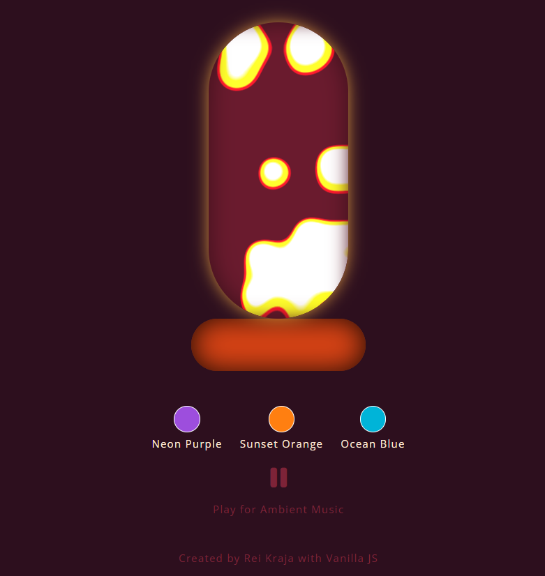

# 023 — Floating Bubble Animation

> **Phase 2 — Animations & Interactivity** | Experiment 23 of 100

---

## 🎯 What It Does

- Renders a themeable lava lamp with floating, blurred bubbles inside a glass shape
- Uses a `.bubble_layer` wrapper with `filter: blur() contrast()` to fuse overlapping bubbles into one continuous "goo" shape, mimicking real lava lamp blob merging
- Applies `mix-blend-mode: screen` on the bubble layer so the goo effect works identically across all themes, regardless of each theme's background color
- Bubbles float up/down/sideways forever via a single `@keyframes float` loop, with randomized size, horizontal position, and animation duration per bubble for a non-mechanical feel
- Bubble colors are theme-aware radial gradients (bright core → theme glow edge) instead of flat white, swapped via CSS custom properties on `body.theme-name`
- Reuses the existing theme-switcher pattern (button click → swap `body` class → CSS variables cascade) for a sound toggle button controlling a single looping ambient `<audio>` track

---

## 💡 What I Learned

- **`filter: contrast()` only pushes RGB channels, not alpha.** A blurred white shape on a transparent background fades via *opacity*, not color, so no matter how extreme the contrast value, there's no color gradient for it to snap into a hard edge. The blur has to fade between two **opaque** colors for contrast to have anything to sharpen.

- **Blurring the layer vs. blurring each element individually are not the same operation.** Blurring individual bubbles blurs each one in isolation before compositing them together, like separate soft stickers placed near each other. Blurring the *parent layer* (after bubbles are already composited as flat opaque shapes inside it) blends neighboring pixels across bubble boundaries as one continuous surface, which is what actually allows two nearby bubbles to visually fuse.

- **The same `contrast()` value treats different colors completely differently.** Contrast pushes every channel away from the 50% midpoint,  channels below 50% crush toward black, above crush toward white. A theme background color with channels close to 50% partially survives; a theme whose channels all sit well below 50% gets crushed entirely to black. Same code, wildly different results per theme, and it looked like a random bug before I worked out the math.

- **`mix-blend-mode: screen` sidesteps the whole per-theme color problem.** Using plain black as the bubble layer's canvas color, `screen` treats black as a no-op (lets whatever's behind it show through untouched) and white as fully opaque. So the real theme background always comes from the untouched `.lava_lamp_glass` element, and the bubble layer only ever contributes the white/gradient blobs on top, no more depending on which color happens to survive `contrast()`.

- **Elements with `position: absolute` don't contribute to their parent's height.** A wrapper div with no explicit height, containing only absolutely-positioned children, computes to 0px height — and combined with `overflow: hidden`, silently clips away everything inside, even though nothing is actually broken.

- **`left` positions an element's edge, not its center — and it matters more at larger sizes.** With bigger bubbles in a narrow glass, using `left` as if it meant "center" skewed everything visually toward one side, since the bubble's body always extends rightward from wherever `left` is set.

---

## 🚧 Challenges I Faced

- **Bubbles vanished after introducing `.bubble_layer`:** the wrapper had no explicit height, its children were all `position: absolute` (so they didn't count toward its height), and `overflow: hidden` clipped the collapsed 0px box. Fixed with `position: absolute; inset: 0;` on the wrapper so it stretches to match its positioned ancestor.

- **Goo effect wasn't merging bubbles at all, even up close:** an isolated two-bubble overlap test (paused animation, manually overlapped) showed soft glowy edges instead of a hard fused shape — revealing that `contrast()` had nothing to sharpen, since the blur was fading to transparency, not to a solid color. Fixed by giving `.bubble_layer` an opaque background so blur produced a real color gradient.

- **Theme backgrounds turned pure black on two out of three themes:** Ocean Blue looked correct, but Neon Purple and Sunset Orange rendered solid black behind the goo. Traced it to `contrast(20)` crushing each theme's background color differently depending on how close its channels sat to the 50% midpoint. Fixed by decoupling the goo canvas color from the real theme background entirely, using `mix-blend-mode: screen` with a fixed black canvas instead.

---

## 🔗 Live Demo

[View Live](https://reiwebdeveloper.github.io/rei_creative_coding_lab/023_floating_bubble_animation/)

---

## 📸 Preview

;

---

## ⏱️ Time Taken

~10h

---

[← Back to Main README](../README.md)