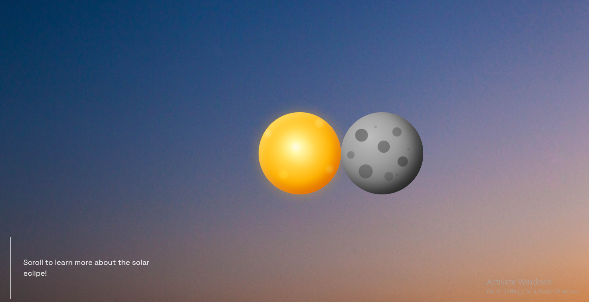
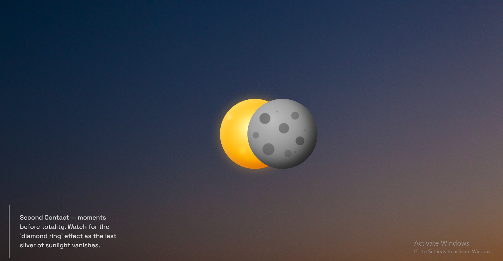
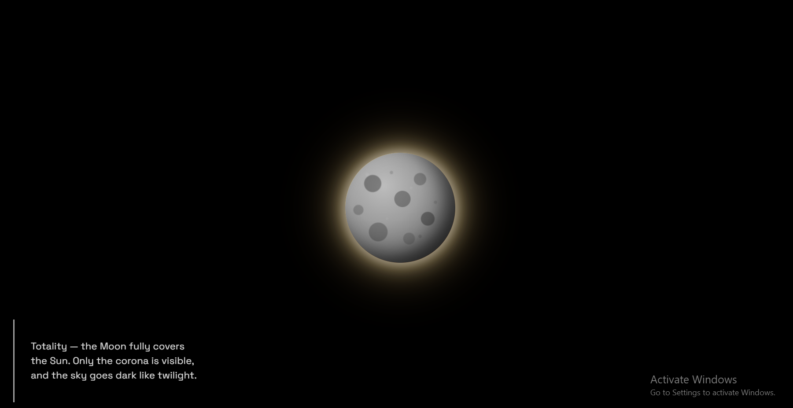
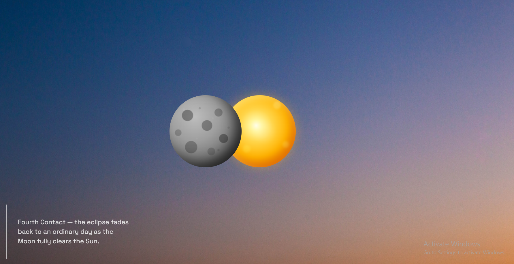

# 025 — Parallax Scroll Scene

> **Phase 2 — Animations & Interactivity** | Experiment 025 of 100

---

## 🎯 What It Does

- Turns vertical scroll into a horizontal story: as the user scrolls down a tall (500vh) page, the Moon slides across the Sun from one side to the other, passing through totality at the midpoint
- Uses `position: sticky` on the visual scene so the eclipse "stage" stays pinned on screen for the full scroll duration, while an oversized wrapper underneath provides the actual scrollable distance
- Converts raw `scrollY` into a normalized `progress` value (0 to 1) by dividing by the total scrollable distance (`wrapper height − viewport height`), then uses that single value to drive every animated property
- Moon position, background darkness, and corona-ring opacity are all calculated with linear interpolation (lerp) between hand-chosen start/end values, mapped to specific "zones" of `progress` rather than the full 0–1 range
- A custom `ease()` function (hand-derived piecewise quadratic ease-in-out) smooths the background/corona opacity transitions so they accelerate and decelerate instead of moving at constant linear speed
- On-screen text updates through six eclipse stages (first contact through fourth contact), using `progress` ranges aligned exactly to the same zone boundaries as the visual effects, so the text change lines up with what's actually happening on screen
- A layered `box-shadow` on a dedicated corona element creates a soft, multi-layered halo effect (white → gold → orange) that only becomes visible in a narrow window around totality

---

## 💡 What I Learned

- **A scroll gesture and a visual animation don't have to move in the same direction.** Vertical scroll input can drive *any* visual output like horizontal movement, opacity, color, because you're not animating scroll directly, you're reading a number (`scrollY`) and deciding what to do with it.

- **`position: sticky` needs two separate layers to work for scrollytelling.** One tall outer wrapper provides scroll distance; a normal-height inner element (the actual sticky one) needs room *within* something taller than itself to have anywhere to "stick" to. Making one element do both jobs doesn't work, sticky has nothing to stick relative to.

- **Percentages measure against the parent's *current* size, every time — they don't preserve a fixed visual gap.** Positioning two elements a fixed % apart looks fine until the viewport resizes, at which point the gap silently changes since both elements' percentages get recalculated against the new, different container size. `calc(50% + Npx)` fixes this by anchoring the proportional part to center while keeping the offset a genuinely fixed distance.

- **`max-width`/`max-height` are ceilings, not fill instructions.** They only stop something from growing past a limit — if the natural size never approaches that ceiling, nothing visibly happens. Filling space requires `width`/`height` directly.

- **Values that change over time must be read *inside* the event listener, not outside it.** Reading `scrollY` once outside a `scroll` listener locks in whatever value existed at that single moment (e.g. on page load) and never updates again, even if the listener fires repeatedly.

- **`radial-gradient()` color stops must ascend outward.** Writing a later stop with a smaller percentage than an earlier one doesn't create a reversed gradient, the browser clamps it, usually producing a flat color with an abrupt edge instead of a smooth fade.

- **Linear interpolation is just "start value + progress × total distance," reused everywhere.** The same lerp pattern solved the moon's position, the background's darkness, and the corona's opacity. Once derived once by hand, it's fully reusable by just swapping in new start/end values and new zone boundaries.

- **A "hill-shaped" animation (rise then fall) isn't one formula — it's two mirrored formulas split at the peak.** Solved by rescaling `progress` into a fresh local 0–1 value for each half-zone (subtracting the zone's start or end point before dividing by the zone's width), then choosing the right formula with an if/else based on which side of the peak `progress` falls on.

- **Ease-in-out isn't built from squaring alone.** Squaring a 0–1 number shrinks small values much more than values near 1, producing a lopsided "ease-in" curve. A symmetric ease-in-out needs a piecewise formula: `2x²` for the first half, `1 − 2(1−x)²` for the second half, meeting cleanly at the midpoint.

- **Repeated code across branches is a signal, not a coincidence.** When the same line shows up in both an `if` and its `else`, it usually means that line doesn't belong to the *decision* at all — it belongs after the decision, running unconditionally.

- **Independently-built logic needs to stay in sync deliberately.** The text-stage boundaries were originally built with a blind evenly-spaced formula (`Math.floor(progress*5)`), unaware of where the opacity/corona zones actually sat — causing "Totality" text to linger well past when totality visually ended. Fixed by rebuilding the stage boundaries around the exact same zone breakpoints as the visual effects, rather than treating text timing as a separate concern.

---

## 🚧 Challenges I Faced

- **Moon position flipped/drifted on window resize:** was using a pure percentage offset (`left: 78%`) which recalculates against the parent's current width every time it changes. Fixed with `calc(50% + fixed-px)`, anchoring to center while keeping the gap a true fixed distance.

- **Sticky positioning didn't stick at all:** `#parallax` was set to both the tall scrollable section *and* the sticky element in one div. This was a contradiction, since sticky needs a taller container to stick within. Fixed by splitting into `#outer_wrapper` (tall, 500vh) and `#parallax` (sticky, 100vh) as two separate nested elements.

- **Background image left a white gap on full screen:** `img` was set to `max-width: 100%` instead of `width: 100%`, so it never actually stretched to fill — it only avoided *exceeding* a size it was never close to reaching.

- **`console.log(progress)` only ever printed one static number, even while actively scrolling:** `scrollY` and `progress` were both calculated once, outside the `scroll` listener, before any scrolling happened. Moved both inside the listener so they recalculate on every scroll tick.

- **"Totality" text stayed on screen well past when the corona/darkness had already faded:** text staging used an evenly-spaced `Math.floor(progress*5)` formula, unrelated to the actual 0.3/0.45/0.5/0.55/0.7 zone boundaries used everywhere else. Rebuilt the stage-number logic as an if/else-if chain using those exact same breakpoints.

- **Duplicate line across an if/else for the text-clamp logic:** `text.textContent = ...` was repeated identically in both branches just to guard against a rare `stageNumber === 5` edge case. Simplified by separating "clamp the number" (a standalone `if`, no `else`) from "display the number" (a single unconditional line after it).

---

## 🔗 Live Demo

[View Live](https://reiwebdeveloper.github.io/rei_creative_coding_lab/025_parallax_effect/)

---

## 📸 Preview

;
;
;
;

---

## ⏱️ Time Taken

~16h

---

[← Back to Main README](../README.md)