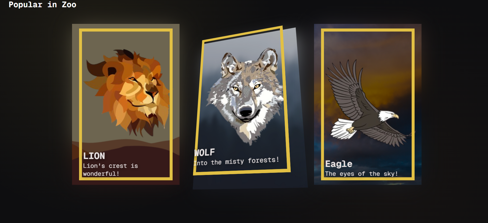
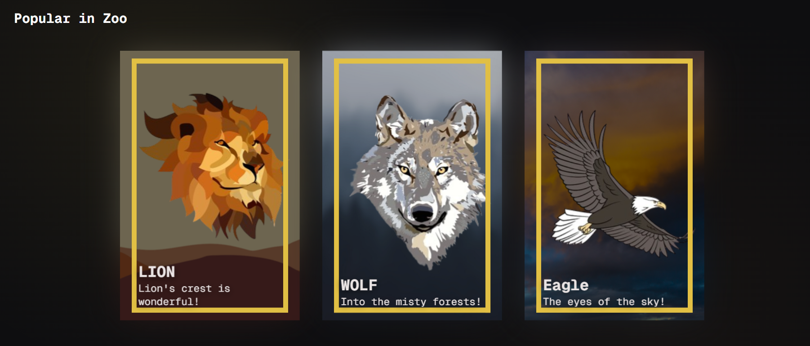

# 027 — Card Hover Effect

> **Phase 2 — Animations & Interactivity** | Experiment 027 of 100

---

## 🎯 What It Does

- Renders a row of "digital zoo" cards (Lion, Wolf, Eagle) that tilt in 3D toward the mouse on hover, with the foreground subject visually popping out past a gold border frame
- Splits each card into stacked depth layers, a blurred/desaturated `.shadow` behind everything, a flat `.background`, a transparent-PNG `.cutout` of the subject pushed forward, and `.content` (title/description) pushed forward furthest, all rotating together via shared CSS custom properties
- Uses two identical border pseudo-elements (`::before`/`::after`) at different z-index depths, one sitting in front of the cutout with one side punched transparent, one sitting behind it fully solid, so the subject appears to breach the frame on exactly one side
- Converts raw mouse position into a normalized tilt angle by measuring offset from each card's own center and dividing by that card's own half-width/half-height, so every card tilts identically regardless of its position on the page or its size
- Smooths the tilt with linear interpolation (lerp) between a stored "current" angle and a stored "target" angle, updated every frame inside a `requestAnimationFrame` loop, so the card eases toward the mouse instead of snapping to it
- Registers `--rotateX`/`--rotateY` via `@property` with `initial-value: 0deg` and `inherits: true`, so every layer has a valid angle to read from the very first paint, before any mouse interaction has happened
- Recalculates each card's bounding rectangle inside the `mousemove` handler itself (not once at page load), so the tilt stays accurate after the page has been scrolled

---

## 💡 What I Learned

- **A parent's transform doesn't just "pass through" to children with `preserve-3d`, it composes with each child's own transform.** Rotating `.card` once *and* rotating every child layer again inside it double-applies the rotation. The rotation belongs on each depth layer individually, driven by the same shared value, not on the parent at all.

- **CSS `transform` functions compose right-to-left, like nested function calls.** `rotate() translate()` and `translate() rotate()` are not the same operation, one spins a point in place then shifts it in a fixed direction, the other carries the point through the spin like a pin on a rotating record. The pop-out effect specifically needs rotate-then-translate to make outer layers sweep a wider arc than inner ones.

- **A visual "3D pop-out" is often just 2D image layers at different Z-depths inside one shared perspective, not real 3D geometry.** The illusion comes entirely from parallax, layers further from the rotation's pivot shift more than layers closer to it, so they visually separate as the card tilts.

- **Two identical-looking pseudo-elements can serve two completely different jobs.** One border copy in front of the cutout (with a transparent gap) reveals the subject breaking through; an identical copy behind the cutout (fully solid) keeps the other three sides looking closed. Giving both the same z-index collapses the illusion, since neither is actually "in front" or "behind" anything.

- **A transparent PNG's edges determine where an effect *can* work, not just how it looks.** A pop-out border-breach only appears where the artwork's opaque pixels actually reach the image's edge, no amount of border-gap or scale alone creates a breach if the asset itself has padding around the subject.

- **Normalize before scaling, always.** Dividing a mouse offset by an *absolute page position* (like a card's X coordinate on the whole page) instead of the *card's own width* means identical mouse movements produce different-sized tilts depending only on where the card happens to sit on the page. Dividing by something tied to the element's own size cancels that out, producing a ratio that means the same thing for every element, which is then scaled into whatever final unit (degrees) is needed.

- **Lerp needs two same-unit values, updated by an independent loop, not one calculation done once per event.** Blending a raw pixel coordinate with a target angle produces a meaningless number, both sides of a lerp must be the same kind of value (e.g. both angles). And calling lerp once inside a `mousemove` handler only produces a single blended jump, true smoothing requires a separate loop (`requestAnimationFrame`) that keeps nudging the current value toward the target every frame, independent of whether the mouse is currently moving.

- **`@property`'s `inherits: false` is a real behavior, not a formality.** Registering a custom property with `inherits: false` (even with a valid `initial-value`) means every child element permanently reads the registered default instead of the parent's live value, breaking any setup where a value is set once on a parent and read by several descendants. Setting `inherits: true` restores the default behavior that plain (unregistered) custom properties already have for free.

- **A cached `getBoundingClientRect()` value goes stale the moment the page scrolls.** It returns a position relative to the *viewport*, not the document, so a value captured once at page load no longer matches reality once the user has scrolled, even though the element's position in the document never changed. Recalculating inside the event handler itself keeps it accurate at the cost of a bit of repeated computation, negligible for a handful of cards.

---

## 🚧 Challenges I Faced

- **Cards only flipped flat instead of separating into layers on hover:** rotation was applied to `.card` alone, and none of its children had `transform-style: preserve-3d` on the parent or any rotation of their own. Fixed by giving every depth layer its own `rotateX/rotateY` plus its own `translateZ`, and adding `preserve-3d` to `.card`.

- **Adding rotation to every layer made the effect worse, not better:** `.card` itself still had the rotation applied on top of its already-rotated children, doubling the tilt. Fixed by removing the rotation from `.card` entirely, leaving `preserve-3d` and `perspective` as its only job.

- **Layers rotated but the pop-out separation looked flat and unconvincing:** each layer's `transform` had `translateZ(...)` written *before* the rotation functions, so translation happened first and rotation second, the opposite order from the reference demo. Fixed by reordering to `rotateX() rotateY() translateZ()` on every layer, matching how CSS composes transforms right-to-left.

- **Border pseudo-elements did nothing (no breach effect at all):** `::before` and `::after` were written identically, same z-index, same everything, so neither was actually in front of or behind the cutout. Fixed by giving `::before` a z-index above the cutout with one side transparent, and `::after` a z-index below it, fully solid.

- **Tilt angle was noticeably weaker on the rightmost card than the leftmost:** the offset formula divided by each card's absolute X position on the page instead of its own half-width, so cards further right (a larger divisor) produced smaller angles for the same mouse movement. Fixed by dividing by `rect.width / 2` instead.

- **The `.shadow` layer looked like a glitchy duplicate card poking out from behind, not a soft shadow:** it had positioning but none of the actual "shadow" styling. Fixed by adding `blur()`, reduced `opacity`, `saturate(0.9)`, and a soft `box-shadow`, so the sharp rectangular edge reads as ambient depth instead of a second copy of the card.

- **Lerp-smoothed rotation made cards fly wildly instead of easing smoothly:** the lerp call was blending a raw pixel mouse coordinate against a computed target angle, two unrelated units, and was only ever called once inside the `mousemove` handler with no ongoing loop. Fixed by storing the target angle in `dataset`, reading the current angle from the live CSS custom property each frame, and lerping between the two inside a `requestAnimationFrame` loop.

- **A single shared `requestAnimationFrame` loop calling all cards' math correctly, but restructuring inside a per-card `forEach` accidentally spun up three redundant loops, each looping over every card:** consolidated back into one shared loop after confirming both structures worked, since one loop handling all cards is simpler for a small number of cards.

- **Cards visibly "popped" in size the instant they were first hovered, then again when the mouse left:** `--rotateX`/`--rotateY` were never given a starting value anywhere, so `rotateX(var(--rotateX))` was invalid before the first mouse event, making the entire `transform` compute to `none` until interaction began. Fixed by registering both properties with `@property` and an `initial-value: 0deg`.

- **After adding `@property`, rotation stopped working entirely, cards sat frozen at 0° even while actively hovering:** the registration used `inherits: false`, so child layers permanently read the registered default instead of the live value being set on `.card`. Fixed by changing both registrations to `inherits: true`.

- **Tilt direction/strength went haywire specifically after scrolling the page, but was correct again right after a refresh:** each card's center coordinates were calculated once at page load using `getBoundingClientRect()`, which is viewport-relative, so the cached value silently went stale the moment the page scrolled while the live mouse coordinates stayed viewport-relative and current. Fixed by moving the `rect`/center calculation inside the `mousemove` handler itself, so it's recalculated on every mouse move.

---

## 🔗 Live Demo

[View Live](https://reiwebdeveloper.github.io/rei_creative_coding_lab/027_hover_card/)

---

## 📸 Preview

;
;

---

## ⏱️ Time Taken

~[22h]

---

[← Back to Main README](../README.md)