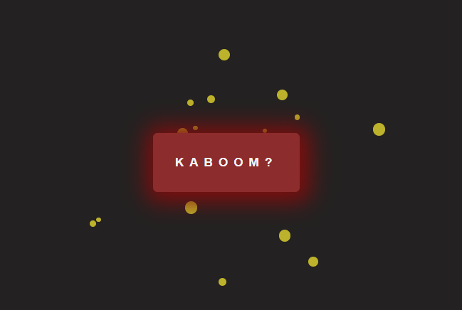

# 028 — Particle Explosion Effect

> **Phase 2 — Animations & Interactivity** | Experiment 028 of 100

---

## 🎯 What It Does

- Renders an expanding burst of colored circular particles from a button's center on click, each with a randomized size, color, launch angle, and travel distance
- Separates particle *data* from particle *rendering*: every particle is one object carrying its own size, color, start/end coordinates, and a direct reference to its own DOM element, rather than relying on loose variables that would vanish after creation
- Computes each particle's destination through trigonometry, converting a random angle (in radians) and a random distance into X/Y offsets via `Math.cos`/`Math.sin`, measured from the button's center
- Animates all particles in sync using one shared progress value (0 → 1) driven by `requestAnimationFrame`, blending each particle's stored start and end coordinates every frame with linear interpolation (`lerp`)
- Fades particles out only during the final 20% of their travel, by rescaling that slice of the progress value into its own fresh 0-to-1 range before applying it to opacity
- Fully resets on every click — clearing the particle array and removing every previous DOM element — so each explosion starts clean instead of stacking on the last one

---

## 💡 What I Learned

- **Pushing the same object into an array repeatedly stores multiple pointers to one "sticky note," not snapshots.** Because objects are passed by reference, reusing one object declared outside a loop and mutating it each iteration means every entry in the array reflects only its *final* state. Freezing data per-iteration requires creating a brand-new object inside the loop.

- **Any "roll the dice" value that should vary per item must be generated inside the loop, not above it.** A random value computed once above a loop gets reused identically by every iteration underneath it — true for particle size, scatter angle, and travel distance alike.

- **An angle plus a distance can be split into independent X and Y offsets via cos/sin**, since each trig function naturally divides one shared distance value differently depending on the angle — no separate X-distance and Y-distance needed.

- **Data a later, separate function will need has to live somewhere that outlives the loop it was calculated in.** A computed end-position or a live DOM element reference declared as a local `const` inside a `forEach` callback disappears the moment that iteration ends. Attaching it as a property on a persistent object (the particle itself) solves this cleanly.

- **`lerp`'s third argument represents overall progress (0 to 1), not a speed.** The small increment added to that progress each frame, and the progress value itself, are two different numbers doing two different jobs — conflating them produces either a frozen particle or one that jumps immediately to its destination.

- **A variable meant to persist and accumulate across repeated function calls has to live outside the function.** Anything declared inside gets recreated from scratch on every single call, silently discarding all prior progress.

- **A guard clause controlling whether a loop continues has to wrap the call that continues it.** An unconditional recursive call placed *after* an `if` block still runs regardless of what that block decided.

- **Perceived animation speed is the product of two independent variables — timing and physical distance — not either alone.** Slowing the frame increment indefinitely does nothing if the actual travel distance is too small to register as visible motion.

- **Fading across only a sub-range of a larger progress value is the same 0-to-1 pattern used for movement, just re-scaled.** Subtract where the sub-range starts, divide by its total width, and the result is its own independent 0-to-1 value ready to feed back into `lerp` (or a direct `1 - progress`).

---

## 🚧 Challenges I Faced

- **Every particle logged the same id, width, height, and color:** a single particle object was declared outside the loop and mutated each iteration, so every push stored a reference to that same object's final state. Fixed by declaring a fresh object inside the loop on every pass.

- **Every particle in one explosion came out the same size:** `randomSize` was calculated once above the loop and reused by every iteration. Fixed by moving the randomization inside the loop.

- **Same bug resurfaced for scatter angle and distance:** both rolls lived above the loop in `createParticle`, so every particle in an explosion traveled to an identical end point. Fixed by moving both randomizations inside the loop.

- **The particle array and rendered elements accumulated across clicks:** neither the `particles` array nor previously appended DOM elements were ever cleared. Fixed with a `reset()` function that zeroes the array's length and removes every existing `.particle` element before the next batch is created.

- **`removeChild` threw "parameter 1 is not of type 'Node'":** the whole `NodeList` from `querySelectorAll` was passed directly into `removeChild`, which expects one element at a time. Fixed by looping over the NodeList and removing each element individually.

- **Particles appeared instantly at their end positions with no motion:** `style.left`/`style.top` were only ever set once, straight to the computed end coordinates, with no intermediate frames. Fixed by splitting one-time setup (`renderParticle`) from a repeating per-frame update (`animateMovement`).

- **`endX`/`endY` and the DOM element reference were unreachable from the animation function:** they were declared as local `const`s inside `renderParticle`'s `forEach` callback and went out of scope once that loop finished. Fixed by storing them as properties (`endX`, `endY`, `element`) directly on each particle object.

- **Animation snapped to one fixed point every frame instead of progressing:** `lerp` was being called with a hardcoded literal (e.g. `0.05`) instead of a value that changed over time. Fixed by introducing a shared `amount` variable, incremented a small amount every frame.

- **Declaring `let amount = 0` inside the animation function reset progress to zero on every call**, preventing any accumulation across frames. Fixed by moving the declaration to module scope, outside the function.

- **The animation loop never stopped:** `requestAnimationFrame` was called unconditionally after the stop-check `if` block, so it re-scheduled itself regardless of that block's outcome. Fixed by moving the recursive call inside the `if` branch, so it only fires when another frame is actually needed.

- **The animation felt too fast even after slowing the frame increment:** the real bottleneck wasn't timing but travel distance — particles were only traveling a small random distance, so no amount of slowing the clock made the motion read as substantial. Fixed by widening the random distance range, which made the existing timing feel natural.

---

## 🔗 Live Demo

[View Live](https://reiwebdeveloper.github.io/rei_creative_coding_lab/02_Animation_&_Interactivity/028_particle_explosion/)

---

## 📸 Preview

;

---

## ⏱️ Time Taken

~[19h]

---

[← Back to Main README](../README.md)