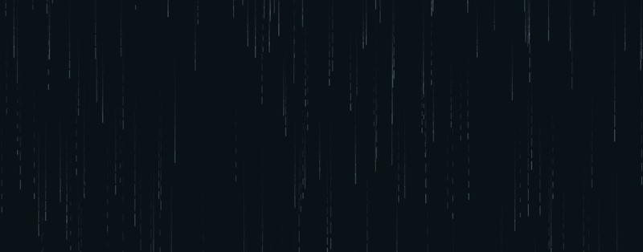

# 029 — Rain Simulation

> **Phase 2 — Animations & Interactivity** | Experiment 029 of 100

---

## 🎯 What It Does

- Renders a continuous field of falling rain streaks on a full-screen canvas, each drop with its own randomized position, length, speed, opacity, and gravity weight
- Models each drop as a `RainDrop` class instance, bundling a drop's data (`x`, `y`, `length`, `speed`, `opacity`, `weight`) and its behavior (`reset()`, `update()`, `draw()`) into one self-contained object, rather than scattering that logic across loose variables and standalone functions
- Uses the class `constructor` purely as a trigger — it calls `this.reset()` immediately on creation rather than duplicating property-assignment logic, so "what a fresh drop looks like" is defined in exactly one place
- Recycles drops in place once they fall past the bottom of the canvas, calling `this.reset()` again inside `update()` to re-randomize that same instance rather than creating new ones — keeping the array size constant for the full lifetime of the animation
- Draws each drop as a straight vertical line using `moveTo`/`lineTo`/`stroke`, and creates a motion-streak trail by only partially clearing the canvas each frame with a low-alpha `fillRect` instead of a full wipe

---

## 💡 What I Learned

- **A class's `constructor` is the one method guaranteed to run automatically, at the exact moment `new` builds the object** — every other method just sits inert on the prototype until something explicitly calls it. A method existing on a class and a method actually running are two different things.
- **`new SomeClass()` does three things under the hood**: creates a bare object, links its prototype to `SomeClass.prototype` (which is why instances can call shared methods like `.update()`/`.draw()` without each one owning a private copy), then runs the constructor with `this` bound to that new object.
- **Pulling `reset()` out as its own method instead of inlining it in the constructor pays off the moment recycling is needed** — the constructor and the "drop went off-screen" branch in `update()` both need identical re-randomization logic, so keeping it in one named method avoids duplicating the same six property assignments twice.
- **Canvas paths work like a pen on paper**: `beginPath()` starts a new path, `moveTo(x, y)` repositions the "pen" without drawing anything, `lineTo(x, y)` extends the path with a line from the current point, and none of it actually paints pixels until `stroke()` (or `fill()`) is called.
- **A translucent background fill (`fillRect` with a low-alpha color) instead of a fully opaque one is what creates a motion trail** — each frame only partially erases the previous one, so fast-moving shapes smear into streaks. This effect is a deliberate visual choice, not a side effect to avoid, but it's calibrated for *fast* motion.

---

## 🔗 Live Demo

[View Live](https://reiwebdeveloper.github.io/rei_creative_coding_lab/02_Animation_&_Interactivity/029_rain_simulation/)

---

## 📸 Preview

---

## ⏱️ Time Taken

~[6h]

---

[← Back to Main README](../README.md)