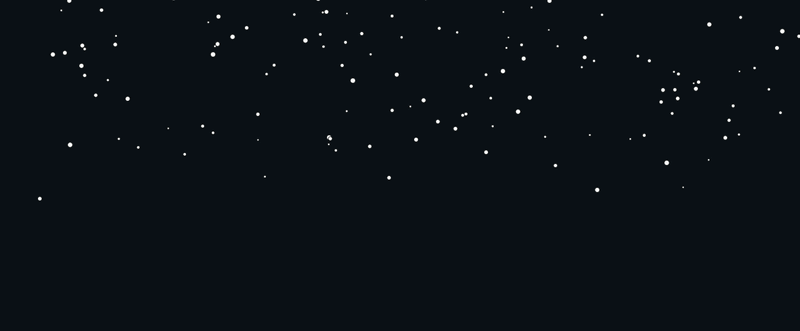

# 030 — Snow Simulation

> **Phase 2 — Animations & Interactivity** | Experiment 030 of 100

---

## 🎯 What It Does

- Renders a full-screen field of gently falling, drifting snowflakes, translated from the previous rain experiment's class-based approach into plain objects and standalone functions instead
- Represents each flake as an object literal (`x`, `y`, `speed`, `width`, `height`, `drift`) that gets created once in `init()` and then mutated in place every frame — no per-flake methods, just shared functions (`reset`, `update`, `draw`) that take a flake object as a parameter
- Randomizes each flake's fall speed, size, and horizontal drift on spawn via `reset()`, and gently accelerates its fall speed and shifts its `x` position every frame in `update()`, recycling it back to the top once it passes the bottom of the canvas
- Tunes fall speed and background-clear opacity specifically for a slow, soft snow look — distinct from rain's fast, streaky motion — after initially inheriting rain's speed range and trail settings by copy-paste
- Draws each flake as a filled circle via `ctx.arc()`, with a fully opaque per-frame background clear to keep flakes crisp instead of trailing

---

## 💡 What I Learned

- **Reassigning a function parameter's local pointer (`snowFlake = newSnowFlake`) never reaches the actual object sitting in an outer array** — objects are passed by reference, but the reference itself is just a local variable inside the function; overwriting what it points to only affects that local variable, not the caller's data. Reaching the real object requires mutating its *properties* directly (`snowFlake.x = ...`), the same way a class method mutates `this`.
- **Creating one object outside a loop and `push`-ing it repeatedly stores the same reference hundreds of times, not hundreds of independent objects** — every array slot ends up pointing at one shared object, so a change to "one" flake visually moves all of them at once. A fresh object literal has to be created *inside* the loop, once per iteration, for each entry to be independent.
- **Calling a bulk-creation function (one that loops and `push`es) as if it were a per-item reset function silently multiplies the array instead of recycling one entry** — mistakenly calling the array-building `reset()` from inside the per-flake `update()` check kept adding 300 new flakes every time a single flake went off-screen, instead of re-randomizing that one flake.
- **`ctx.fillStyle` is sticky** — it doesn't reset itself between frames. Setting it inside `draw()` (for the flakes) without ever resetting it before the background `fillRect()` in `animate()` meant the background wipe silently inherited whatever color was last used for drawing, producing a blank/white-looking canvas with no visible error.
- **A canvas motion trail and a hard shape edge come from the same two settings, tuned oppositely** — the translucent low-alpha background clear that gave rain its streak was copy-pasted into the snow version along with rain's fast speed range, producing the same comet-tail look. Removing leftover `moveTo`/`lineTo` calls left over from the rain circle-drawing code, and clearing to full opacity instead of partial, resolved the tail.
- **Perceived fall speed comes from two separate levers that compound over time, not one number** — a per-flake starting speed range set once at spawn, and a small per-frame increment applied continuously in `update()` for as long as that flake is visible. Slowing the fall convincingly meant reconsidering both, not just one.
- **A wandering, non-vertical motion (drift) follows the same store-once/apply-every-frame pattern as fall speed** — a `drift` value randomized once in `reset()` and added to `x` every frame in `update()` is enough to turn a perfectly straight vertical fall into a gentle side-to-side wander.

---

## 🚧 Challenges I Faced

- **All 300 flakes appeared to move identically as one unit:** a single object literal was declared outside the `init()` loop and pushed into the array 300 times, so every array entry referenced the same object in memory. Fixed by moving the object literal declaration inside the loop, creating a fresh one per iteration.
- **The snowfall multiplied uncontrollably into a blizzard:** the per-flake `update()` function called the bulk `reset()` (the one that loops `maxSnowFlakes` times and `push`es) every time a single flake passed the bottom of the canvas, instead of a per-flake reset. Fixed by rewriting `reset()` to take one flake object and mutate its properties directly, with no loop and no `push` inside it.
- **A reassignment inside `reset()` had no effect on the array:** `newSnowFlake = { x: 0, ... }` followed by `snowFlake = newSnowFlake` only reassigned the local parameter to a new object, leaving the real object in `snowFlakes[]` untouched. Fixed by removing the intermediate object entirely and assigning properties straight onto the parameter that was passed in.
- **`init()` pushed `undefined` into the array:** calling `reset(snowFlake)` inside `init(snowFlake)` relied on a parameter that was never actually passed when `init()` was called. Fixed by building a fresh, empty flake object inside the loop and immediately passing that into `reset()`.
- **The canvas rendered as a solid white screen:** `ctx.fillStyle` was left set to `"#fff"` (from drawing the last flake of the previous frame) with nothing resetting it before the next frame's background `fillRect()`. Fixed by explicitly setting `fillStyle` back to the background color immediately before the background fill.
- **Flakes were invisible even after the white-screen fix:** freshly created flake objects were pushed with all properties zeroed (`width: 0`, `speed: 0`) and never had `reset()` called on them afterward, so every flake existed but was zero-sized and stationary. Fixed by calling `reset(newSnowFlake)` immediately after each `push` inside `init()`.
- **Snow looked identical to rain — fast streaks instead of soft flakes:** the speed range and translucent trail-clear alpha were copy-pasted straight from the rain experiment, and a leftover `moveTo`/`lineTo` pair (meant for rain's line-drawing) was still running on top of each circle. Fixed by removing the leftover line-drawing calls, switching the background clear to full opacity, and lowering the speed range to suit snow.
- **Snowfall still felt too fast after removing the streak:** the fix wasn't in the visual trail but in the numbers — the starting speed range and the per-frame speed increment were both still tuned for rain. Fixed by narrowing the random starting speed range down to a slower band.

---

## 🔗 Live Demo

[View Live](https://reiwebdeveloper.github.io/rei_creative_coding_lab/02_Animation_&_Interactivity/030_snow_simulation/)

---

## 📸 Preview

---

## ⏱️ Time Taken

~[4h]

---

[← Back to Main README](../README.md)