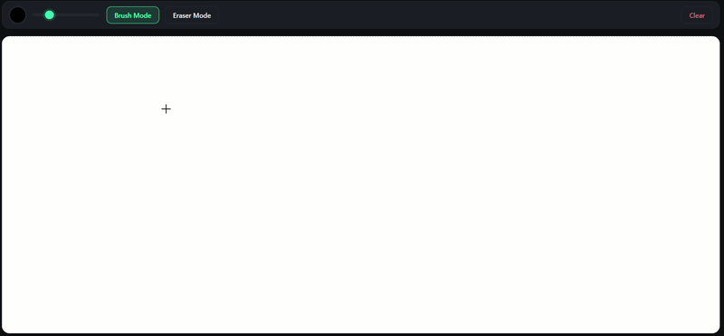

# 031 — Paint App

> **Phase 2 — Animations & Interactivity** | Experiment 031 of 100

---

## 🎯 What It Does

- Renders a full-window drawing canvas with a toolbar for picking a color, adjusting brush size, switching between brush and eraser mode, and clearing the whole canvas
- Draws each stroke as a series of short line segments: on every pointer move, it connects the previous position (`lastX`, `lastY`) to the current one with `moveTo` / `lineTo` / `stroke`, using round line caps and joins so the trail looks smooth instead of blocky
- Handles mouse, touch, and pen through one pair of pointer-event listeners (`pointermove` and `pointerenter`) instead of separate mouse and touch code paths
- Decides whether to draw by asking the event itself (`e.buttons & 1`) instead of tracking an `isDrawing` flag by hand
- Records the pointer position on every move, drawing or not, so a stroke that starts after hovering begins at the right point, and uses `pointerenter` to reset that position when a pointer arrives with the button already held down
- Wears a modern dark "card" toolbar with a round color swatch, a custom slider, active-state buttons, and the canvas floating below it like a sheet of paper, with every color stored in CSS variables

---

## 💡 What I Learned

- **Pointer events cover mouse, touch, and pen with one set of listeners** — they are built on top of mouse events, so they carry `offsetX` / `offsetY` no matter what the input is. The touch-only helpers (`getTouchPos`, `startDrawingTouch`, `drawTouch`) existed only because touch events don't have those properties, and they could all be deleted.
- **`touch-action: none` in CSS replaces `e.preventDefault()` in touch handlers** — it tells the browser not to scroll or zoom when a finger moves over the canvas, so the drawing handlers don't need to block it themselves.
- **`pointermove` fires on every movement, pressed or not — the code decides what to do about it** — the browser only reports that something happened. It was my own gate that stopped hovering from drawing, which is why I couldn't find the answer in the documentation.
- **`e.buttons` is a bitmask describing which buttons are currently held** — `0` means nothing is pressed, `1` is the primary button (left click, or a finger or pen touching the screen), `2` is the right button, and `4` is the middle button. If several are held, the values add up. Testing only the primary bit with `e.buttons & 1` is safer than `e.buttons === 0`, which lets a right-click through.
- **Asking the event is better than maintaining a variable by hand** — checking `e.buttons` replaced `isDrawing`, `stopDrawing`, and the `pointerup` / `pointercancel` listeners, which means one fewer piece of state that can get out of sync with reality.
- **`lastX` and `lastY` only update when a `pointermove` reaches the canvas** — while the pointer is outside, nothing arrives, so the position stays frozen at the point where it left. Dragging back in with the button held then draws a straight line from that exit point to the entry point.
- **Recording the position outside the drawing condition removed the need for `pointerdown`** — moving `[lastX, lastY] = [e.offsetX, e.offsetY]` out of the `if (e.buttons & 1)` block means every hover keeps the position current, so by the time I press, it's already correct and `startDrawing` is redundant.
- **`pointerenter` is still needed, especially for fingers** — a mouse dragged in from outside never fires `pointerdown` on the canvas, and a finger can't hover, so there are no events before its first move. Deleting `pointerenter` brought the straight lines back, and restoring it fixed them. It's the one place that says "the pointer is here now."
- **`setPointerCapture` solves a different problem** — it keeps events coming after the pointer *leaves* an element, and it needs a `pointerId` because several pointers can exist at once (`releasePointerCapture` is the undo). My bug was about a pointer *entering*, so the final version doesn't use it.
- **Testing on a phone means using the computer's local IP, not `127.0.0.1`** — `127.0.0.1` means "this same machine", so on a phone it points at the phone itself. Keeping the port and path but swapping in the computer's `192.168.x.x` address (on the same Wi-Fi) opens the page from Live Server.
- **A phone browser has no console, so the page itself can be the console** — writing a value like `e.buttons` into a `
` inside `draw` shows it live on screen with no tools. A finger reported `1` while touching, and it can't hover, so `pointermove` only fires when the screen is touched.

---

## 🚧 Challenges I Faced

- **The eraser was a different size on mouse and on touch:** the mouse version multiplied the line width by 4 while the touch version multiplied it by 2. The root cause was writing the drawing logic twice in two parallel sets of functions. Fixed by moving to pointer events, which leaves a single `draw` function.
- **The console showed `1` with a number in parentheses and I didn't know what it meant:** Chrome collapses repeated identical logs into one line with a repeat count, so it was `1` logged 129 times in a row. Fixed by understanding the repeat count, and by moving the `console.log(e.buttons)` above the gate in `draw` so both the hovering case (`0`) and the pressed case (`1`) were visible instead of only the pressed one.
- **I couldn't explain why hovering didn't draw:** I searched the code and the documentation for an answer and didn't find one, because it wasn't in the pointer-event documentation at all. The answer was my own gate on the first line of `draw`. Fixed by reading the flow of my own code step by step and then predicting, and confirming, what would happen with the gate commented out.
- **Pressing outside the canvas and dragging in drew a straight line:** the press never fired `pointerdown` on the canvas, so `lastX` and `lastY` still held an old position, and the first move connected it to the entry point. Fixed with a `pointerenter` handler that resets the position the moment the pointer crosses into the canvas.
- **Deleting both resets broke it again:** I expected that recording the position on every move would make `pointerenter` and `startDrawing` unnecessary, but testing showed the straight line returning when dragging in, and it also happened with a finger on my phone. Fixed by deleting only `startDrawing` and keeping `pointerenter`.
- **`e.buttons === 0` still lets the right mouse button draw:** a right-click reports `2`, which isn't `0`, so it passes the gate. Fixed by testing only the primary-button bit with `e.buttons & 1`.
- **Opening the app from my phone:** the `127.0.0.1` link from Live Server doesn't work on another device. Fixed by replacing it with my computer's local IP address while keeping the port and file path.
- **Seeing the console on my phone:** a mobile browser doesn't have DevTools. Fixed by temporarily displaying `e.buttons` inside a `
` on the page.

---

## 🔗 Live Demo

[View Live](https://reiwebdeveloper.github.io/rei_creative_coding_lab/02_Animation_&_Interactivity/031_paint/)

---

## 📸 Preview

---

## ⏱️ Time Taken

~[12h]

---

[← Back to Main README](../README.md)